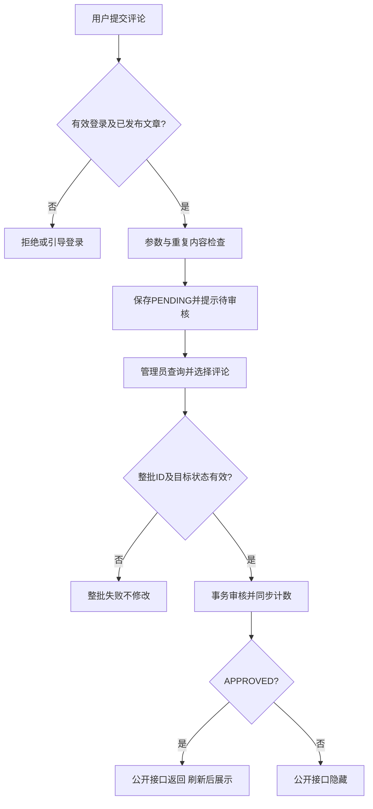
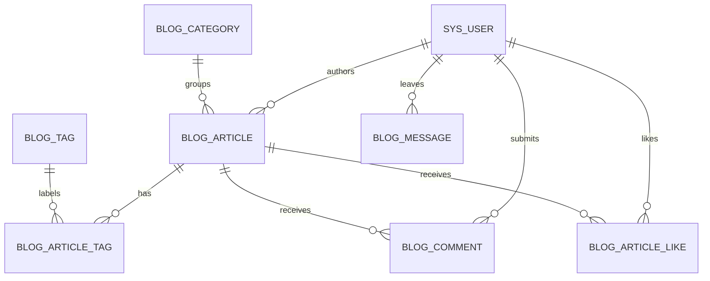

# 个人博客系统角色权限及主要业务流程

> 12.5-D当前状态：用户于2026-10-08通过ChatGPT异步正式批准79项本期需求、BLOG-NF-012后续候选及全部80项优先级（Must57 / Should22 / Could1），授权建立SRS v1.0.0。文档级正式需求基线已建立；Git固化尚未执行。需求批准不代表代码完成或测试通过，也不是教师审批或学校验收。此前v0.8及各阶段候选状态仅为历史。

文档版本：v0.9（12.5-D状态同步；对应SRS v1.0.0）
整理日期：2026-10-08 
代码参照：`8febf5d`；本轮只静态核对源代码，未运行业务或数据库验收。 
配套文件：[完整需求清单](requirements-inventory.md)

## 1. 说明范围

本文件整理现有行为，服务于后续SRS、用例与测试设计，不是假定的开发前需求分析。引用BLOG-F/NF/BR编号均指本次登记并于12.5-D审批的需求；二十项指定范围已由用户于2026-10-08通过多批ChatGPT异步确认（见第7节），总体方向均已确认；残余技术及验收细节仍待设计/补充；不代表历史会议或整体需求基线。本项目在全流程Skill建立之前已经开发，不能据本文件补造Skill指导开发历史。

实际技术依据为前端package.json和后端pom.xml：Vue 3、Vite、Vue Router、Pinia、Element Plus、Axios、ECharts、marked、DOMPurify；Java 17、Spring Boot 3.3.5、MyBatis Plus 3.5.8、Spring Security、JWT、BCrypt、Mail、Validation；数据库脚本面向MySQL 8。本文件不重复技术研究报告。

## 2. 角色及权限

### 2.1 角色定义

| 使用角色 | 实际含义 | 访问能力 |
| --- | --- | --- |
| 游客 | 没有已认证身份，不是sys_user中的第三种role | 浏览公开内容、注册、登录、申请验证码及重置密码 |
| 普通用户 | sys_user.role=USER，status=ACTIVE且未逻辑删除；受保护请求携带有效JWT | 公开浏览、本人资料维护、点赞、评论、留言及喜欢列表；无后台权限 |
| 管理员 | sys_user.role=ADMIN，其他身份条件同上 | 普通用户操作及后台统计、文章、用户、审核、分类、标签、站点配置 |

禁用是账号状态，不是额外角色。账号禁用后仍能像游客一样浏览公开内容，但不能以旧Token进行受保护操作。管理员没有独立登录页或自行注册ADMIN入口。

管理员“拥有普通用户能力”是业务权限描述；JwtFilter每次只赋一个`ROLE_`加数据库role的权限，不是同时赋ROLE_USER和ROLE_ADMIN。普通用户操作只要求authenticated，所以管理员同样可使用。

### 2.2 权限矩阵

| 操作 | 游客 | USER | ADMIN | 实际限制/依据 |
| --- | --- | --- | --- | --- |
| 首页、公开列表/详情、关于我 | 允许 | 允许 | 允许 | PublicController/PublicArticleController，公开文章须发布 |
| 查看评论/留言 | 允许 | 允许 | 允许 | InteractionServiceImpl仅返回APPROVED；评论对应有效已发布文章 |
| 注册/登录/邮箱重置接口 | 允许 | 接口公开 | 接口公开 | 前端guestOnly页面把已登录者重定向；不代表后端这些接口禁已登录 |
| 点赞/取消、提交评论/留言 | 不允许，页面引导登录/接口401 | 允许 | 允许 | 身份取AuthPrincipal，无客户端任意用户ID |
| 查看本人信息/改名/上传/改密码/喜欢列表 | 不允许 | 仅本人 | 仅本人 | UserProfileController，查询资料走/api/auth/me或/profile |
| 后台页面/后台API | 登录跳转或401 | 页面返回首页/API403 | 允许 | 路由meta与SecurityConfig，服务器是最终判定 |
| 调整他人USER/ADMIN角色 | 不允许 | 不允许 | 允许 | 禁止修改自己的角色 |
| 启用/禁用他人账号 | 不允许 | 不允许 | 允许 | 禁止禁用自己；不会删除历史互动 |
| 文章新增/编辑/草稿/发布/删除 | 不允许 | 不允许 | 允许 | 可以管理其他管理员文章，无“仅本人文章”限制 |
| 评论/留言通过或拒绝 | 不允许 | 不允许 | 允许 | 单条/批量同接口；无删除评论/留言按钮 |
| 分类、标签、站点配置 | 不允许 | 不允许 | 允许 | 引用删除及停用规则见需求清单Q08/Q14 |

### 2.3 鉴权及客户端边界

1. [SecurityConfig](../../blog-server/src/main/java/com/example/blog/security/SecurityConfig.java)允许`/api/public/**`、注册、登录、`/api/auth/password/**`、`/uploads/avatars/**`、`/error`匿名访问；后台要求ADMIN，其他业务请求要求登录。
2. [JwtFilter](../../blog-server/src/main/java/com/example/blog/security/JwtFilter.java)跳过公开入口；受保护请求校验Bearer、签名、有效期，再查`selectActiveById`并比较tokenVersion。使用数据库当前用户名/角色建立身份，禁用或版本不符返回401。
3. [Axios](../../blog-web/src/utils/request.js)不给公开/登录/注册/重置接口附加Token；受保护401清本地并跳登录，403不退出。API路径以`/api`为前缀。
4. [路由守卫](../../blog-web/src/router/index.js)执行restoreSession，未登录访问受保护页跳`/login?redirect=...`，角色不符回首页。Store已有Token与用户缓存时不会自动刷新服务器资料，因此UI可能暂时显示旧角色；并不改变服务器安全规则。
5. 现状：退出仅清前端，无服务器注销API；启停不改变版本，启用后旧Token可能恢复。目标：Q03确认保留本地退出、本期暂缓服务器主动注销；禁用前Token在启用后不得恢复，须重新登录。尚未实施或验证。
6. 公开接口跳过JWT并不等于所有公开页面无跳转风险：详情页若缓存显示已登录，会附带请求受保护的点赞状态；失效Token的401可触发Axios跳登录。Q02目标已确认：该附带失败不得强制转登录，仍可公开阅读，主动互动继续鉴权；代码未修复，需后续测试。恢复查me/角色刷新细节不随本次自动确认。

## 3. 业务模块及页面对应

### 3.1 14个业务模块

| 模块 | 业务职责 | 需求ID |
| --- | --- | --- |
| M01 用户认证与访问控制 | 注册、登录、状态恢复、退出、路由及接口权限 | F-001—005 |
| M02 邮箱验证码密码重置 | 发送码、验证码重置及SMTP发送 | F-006—007 |
| M03 首页与站点介绍 | 首页导航、最新热门、关于我、404 | F-008—009、014—015 |
| M04 文章检索 | 标题搜索、分类/标签筛选、分页 | F-010—011 |
| M05 文章详情与阅读导航 | Markdown、阅读统计及相邻文章 | F-012—013 |
| M06 点赞与喜欢文章 | 点赞切换及本人喜欢列表 | F-016—017 |
| M07 评论与审核 | 公开评论、提交、后台检索/统计/批量审核 | F-018—019、036—037 |
| M08 留言与审核 | 留言分页、提交、后台检索/统计/审核 | F-023—024、038—039 |
| M09 个人资料与账户维护 | 本人信息、改名、头像、当前密码改密 | F-020—022 |
| M10 后台统计 | 数量和最近7日发布趋势 | F-025 |
| M11 后台文章管理 | 查询、编辑、发布撤回、删除、置顶 | F-026—030 |
| M12 分类标签维护 | 名称/别名/描述/状态/分类排序及引用删除约束 | F-031—032 |
| M13 用户管理 | 用户查询、角色调整及账号状态 | F-033—035 |
| M14 站点配置维护 | 五项站点数据维护及公开读取 | F-040 |

编号均补完整前缀`BLOG-`；模块数不是页面数，评论和留言各自把提交与审核归为同一业务闭环。

### 3.2 15个有效页面和真实路由

组件名除NotFound外均在`blog-web/src/views/public/`或`admin/`；以[实际路由文件](../../blog-web/src/router/index.js)为准。

| 页面 | 路由 | 组件 | 权限 | 主要跳转 |
| --- | --- | --- | --- | --- |
| 首页 | / | public/Home.vue | 公开 | 文章列表、关于我、文章详情；公共导航提供其他入口 |
| 文章列表 | /articles | public/ArticleList.vue | 公开 | 文章卡片→/articles/{id}；query记录筛选/页码 |
| 文章详情 | /articles/:id | public/ArticleDetail.vue | 公开 | 相邻详情；游客互动→带redirect的/login；错误→/articles |
| 关于我 | /about | public/About.vue | 公开 | 公共导航；联系邮箱mailto |
| 留言板 | /message | public/Message.vue | 公开；提交需登录 | 游客提交→/login并带redirect；页内分页 |
| 个人中心 | /profile | public/Profile.vue | 登录 | 喜欢文章→详情；管理员→后台；退出→/；改密成功→/login |
| 登录与注册 | /login | admin/Login.vue | guestOnly | 注册后切换登录；登录→redirect或按角色进/admin或/；找回→/forgot-password |
| 找回密码 | /forgot-password | public/ForgotPassword.vue | guestOnly | 成功或返回按钮→/login |
| 数据概览 | /admin | admin/AdminDashboard.vue | ADMIN | 写文章→/admin/articles，后台菜单切换 |
| 文章管理 | /admin/articles | admin/ArticleManage.vue | ADMIN | 页内抽屉新增/编辑，不增加页面；后台菜单切换 |
| 用户管理 | /admin/users | admin/UserManage.vue | ADMIN | 页内确认框修改角色/状态 |
| 评论管理 | /admin/comments | admin/CommentManage.vue | ADMIN | 所属文章新窗口→/articles/{id}；页内筛选/审核 |
| 留言管理 | /admin/messages | admin/MessageManage.vue | ADMIN | 页内筛选/审核 |
| 系统管理 | /admin/settings | admin/SystemManage.vue | ADMIN | 分类、标签、配置为页签；分类标签编辑用弹窗 |
| 页面不存在 | 未匹配路径 | views/NotFound.vue | 公开 | 返回/；不是独立注册的/404路由 |

共15页：8个前台/用户、6个后台、1个404。PublicLayout/AdminLayout是布局，不另算页面；登录注册两个页签算1页；后台三个配置页签不各算1页。`views/public/Articles.vue`、`views/admin/Dashboard.vue`、`views/PlaceholderView.vue`未接入当前路由，不算有效页面。现有[用例图源文件](../design/use-case/系统用例图.puml)可作为后续用例说明的素材，但不是需求确认记录。

## 4. 主要业务流程（现有代码）

以下描述调用链只是为明确业务可追踪性，不是完整实现说明。流程中的“成功”是代码设计分支，非本轮实测结论；对应具体证据见需求清单E索引。

### 4.1 注册、登录及恢复（F-001—003、005）

游客打开Login注册页签 → 输入用户名、邮箱、密码及确认 → authApi注册 → AuthController参数验证 → UserServiceImpl比较确认密码、校验用户名/邮箱唯一 → BCrypt编码 → sys_user插入USER/ACTIVE、nickname=用户名、token_version=0 → 返回UserVO → 页面提示并切回登录（不自动发Token）。

登录输入 → POST /api/auth/login → 校验DTO → Service查询账号、核对密码及状态 → JWT签发用户ID、username、role、tokenVersion、签发与过期时间 → LoginVO返回accessToken和user → Pinia与localStorage保存 → 跳原请求地址或按角色进首页/后台。Q01已确认三入口最大50且前后端数据库一致；登录当前仍30，未修复。最小/字符/空白政策未被此次确认，不擅自增加。

刷新 → Store读取缓存 → 仅有Token无用户时GET /api/auth/me → 服务器返回本人资料；两者都有时不强制刷新 → 后续受保护请求由JWT过滤器再次检查数据库状态与权限。退出清本地缓存，个人页回首页、后台回登录页。

### 4.2 邮箱找回密码（F-006—007）

登录页“忘记密码” → 邮箱表单校验 → POST /api/auth/password/reset-code → 服务trim并小写化邮箱，查注册且ACTIVE用户 → 查询最近RESET_PASSWORD记录 → 拒绝60秒内重复发送 → 旧未用码标记used=1 → SecureRandom生成六位码并存5分钟有效期 → EmailService发送邮件 → 成功后前端60秒倒计时。

输入验证码及两次新密码 → POST /api/auth/password/reset → 校验格式/长度、一致性 → 查邮箱/账号状态、type/code → 检查used和expire_time → 拒绝新旧相同密码 → 条件更新验证码used=1 → BCrypt更新password → 事务成功 → 前端提示并返回/login。该路径目前不递增token_version；Q05已确认两条改密成功后所有旧Token失效、必须重登。目标流程须包含废旧Token，但具体机制待设计，当前未实现。Q04真实收件闭环目标已确认，但本轮未验证。

### 4.3 首页、检索及详情（F-008—015、030）

首页分别请求配置、latest(5)、hot(3) → 返回已发布未删除文章 → 展示卡片 → 点击进入详情。热门从全站有效已发布文章按阅读、点赞、发布时间排序，不是只在首页最新文章中排序。首页不调用featured；置顶体现在文章列表排序及单独接口。

文章列表输入标题关键词、选分类/标签、翻页 → 条件写URL并请求GET /api/public/articles → ArticleService基于标题LIKE、分类及标签关联ID过滤 → 强制PUBLISHED、逻辑删除过滤、置顶/发布时间排序 → MyBatis Plus分页 → 页面显示records/total或空状态。公开分类标签列表只返回ACTIVE。Q07已确认有效URL/控件/结果同步及前进后退、合法直达恢复；现状未watch路由query，后续设计修复，未执行验证；replace可保留，不要求逐操作新增历史。

详情GET /api/public/articles/{id} → 检查文章存在且已发布 → SQL阅读量+1 → 返回正文与统计/分类标签 → marked转换、DOMPurify净化后展示 → 另读相邻文章及公开评论，已登录者查本人点赞状态。详情不存在/草稿时页面提示并返回列表。相邻按发布时间升序，当前没有最终唯一字段排序保证；Q09目标需确定性次级排序，具体字段/方向未定，不虚构已采用ID。

### 4.4 点赞与喜欢列表（F-016—017）

详情点击喜欢 → 游客转登录；已登录调用POST /api/articles/{id}/like → 身份取JWT → 检查发布文章 → 现有关系则返回成功，否则插入(article_id,user_id)联合键关系并增计数；重复键不再计数 → 页面更新按钮和数量。

取消调用DELETE同路径 → 关系真实删除时且计数>0才减1 → 页面切换。个人中心GET /api/users/me/likes → 读取当前用户点赞文章ID → 仅取已发布未删除文章、按发布时间分页 → 点击进入详情。不存在单独收藏表；“喜欢”就是点赞关系。

### 4.5 评论提交、审核及展示（F-018—019、036—037）

登录用户在详情输入非空≤500字符评论 → POST /api/articles/{id}/comments → 验证身份/发布文章 → trim并插入PENDING → 返回成功 → 清输入、提示“评论已提交，审核后展示”；不重新请求文章详情，不把待审内容放入公开列表。

管理员默认查看PENDING，按内容搜索/分页 → 选择当前页记录 → 确认通过或拒绝 → PATCH /api/admin/comments/status，{ids,status} → 去重ID、校验全部存在 → 事务逐条转换状态 → 根据通过状态变动同步文章comment_count → 返回后清选择并刷新 → 访客刷新详情只读APPROVED，拒绝后隐藏。

该图表现顺序业务流程，不表示并发审核已经验证无重复计数；相同状态重复顺序请求有幂等代码。评论无回复层级，公开列表无分页；Q11已确认本期保留此展示及首字头像，分页/图片增强暂缓，不取消个人中心头像上传。

### 4.6 留言提交和审核（F-023—024、038—039）

公开留言板GET /api/public/messages每页10条 → 返回APPROVED倒序数据。登录用户POST /api/messages提交内容 → 参数/身份校验 → 保存PENDING → 提示待审并清空输入，不插入公开列表。

管理员GET /api/admin/messages按状态/关键词查询 → 当前页选择 → PATCH /api/admin/messages/status通过/拒绝 → 校验全部ID、事务更新、同状态不重复更新 → 公开分页刷新后显示或隐藏。留言仅关联user_id，不关联文章，没有评论计数更新。禁用用户之前已通过留言仍保留。

### 4.7 个人资料和当前密码改密（F-020、022）

个人中心读取auth.user，展示资料 → 用户改名 → PUT /api/users/me → AuthPrincipal取本人ID → DTO非空/最大50、服务唯一校验 → username与nickname同改 → 返回UserVO同步Pinia/localStorage及顶部显示。邮箱只展示，不可编辑；没有昵称独立编辑字段。

填写当前密码、新密码、确认 → PUT /api/users/me/password → 服务验证当前密码、新密码一致且不同于旧密码 → BCrypt保存并token_version+1 → 前端清状态、提示重登 → 旧Token后续请求版本不符401。更新影响行数的失败边界需测试，不能提前宣称测试通过。

### 4.8 本地头像上传（F-021）

当前头像旁“更换头像” → 文件窗口 → 前端检查扩展/MIME和≤5MB → Object URL本地预览（非Base64）；取消撤销URL且不上传 → 保存时FormData字段file → POST /api/users/me/avatar → JWT确认本人 → 存储服务验证非空、大小、扩展/MIME/文件头一致 → UUID命名（jpeg→jpg） → 写配置的头像目录 → 更新sys_user.avatar相对路径 → 提交后安全删除旧受管UUID图片；回滚清新文件 → 返回{avatar} → Pinia及缓存合并新路径，个人中心/顶部同步。

`/uploads/avatars/**`匿名静态读取。默认后端从blog-server运行时保存于blog-server/uploads/avatars；AVATAR_UPLOAD_DIR可覆盖位置，不能把路径假定为固定部署磁盘。数据库不保存二进制。空头像/加载失败显示用户名首字；前台评论留言目前依然显示首字头像，不自动换成图片。

### 4.9 后台文章与分类标签（F-026—032）

管理员查询文章 → 新增/编辑抽屉 → GET已有详情（不计阅读）及分类标签列表 → 输入标题/slug/正文/分类、可选标签和外部封面URL → POST或PUT /api/admin/articles → DTO及slug唯一、分类存在、标签ACTIVE校验 → 新建作者取管理员ID；更新保留作者 → 按草稿/发布设置published_at → 事务保存文章和替换去重标签关联 → 列表刷新。

持续发布编辑保留发布时间；撤回为草稿清时间；再次发布设新时间。没有独立PATCH发布接口。删除确认后DELETE文章：逻辑删除文章并显式删除标签关联，评论和点赞不同时物理删除，无回收站。Q14已确认保留该政策，无新增物理清理机制；已删文章不公开，历史评论仍可后台查询，评论统计与文章统计分别按自身实体过滤。

系统管理页分类/标签页签维护数据：分类含sortOrder，标签不含排序字段；引用有效文章的分类拒删、存在文章标签关联的标签拒删。分类停用目前不妨碍编辑分配；标签停用后原文能显示，但编辑保存仍带该标签会失败。Q08目标已确认：禁止新文章或其他文章新增停用关联；停用保留历史，编辑本文章不改变原停用关联须允许保存。现有分类存在检查及标签ACTIVE一刀切校验不符合这一目标，本轮未修改。

### 4.10 后台用户管理（F-033—035）

管理员分页/关键词查用户 → 选择角色或启停 → 确认 → PATCH /api/admin/users/{id}/role或/status → DTO值域检查 → Service本人限制、账号存在检查 → 更新role/status → 刷新列表。

JWT后续读取数据库状态/角色，禁用旧Token被拒，降级不能后台；历史评论留言不删除。管理员不能禁用自己或修改自己的角色；没有用户删除操作。用户启用不会自动改变密码或提升角色，也不递增令牌版本。

### 4.11 概览、站点配置和关于我（F-025、040、014）

概览并行读文章overview、publish-trend、用户stats、评论stats → 汇总数量、ECharts近7日折线图及发布比例。总用户包含禁用账号，总评论包含待审/通过/拒绝；趋势统计当前PUBLISHED且published_at在对应日期的记录，不是事件历史。请求失败的旧“尚未接入”文案是待改进点，不能说统计API不存在。

系统管理填写五项站点数据 → PUT /api/admin/site-config的Map → Controller按key查/插入/更新键值表 → 返回成功 → 刷新公开页面重新读取配置 → 品牌/副标题、首页介绍、关于我及联系邮箱显示。无全局实时推送，现状新键、null和整批失败边界未验证，公开接口全表。Q12/Q15目标为合法五键原子保存、非法null/未知键拒绝且不半写，公开仅五键；字段空字符串、长度与非空邮箱格式已确认；默认值、缺失键和技术计数仍待设计/确认，密钥不进入公开表。

## 5. 数据实体与关系

以[实体目录](../../blog-server/src/main/java/com/example/blog/entity)、[Mapper目录](../../blog-server/src/main/java/com/example/blog/mapper)和[schema.sql](../../blog-server/src/main/resources/schema.sql)核对；未读取实际运行数据库。以下只说明主要关系，不替代数据库设计章节。

| 实体/表 | 用途与关系 | 数据边界 |
| --- | --- | --- |
| User / sys_user | 用户；通过author_id关联文章、user_id关联评论/留言/点赞 | username/email唯一，role和status独立，token_version用于失效检查；password忽略序列化 |
| Article / blog_article | 文章；category_id→分类、author_id→用户 | 分类/作者外键RESTRICT；状态、发布时间及阅读/点赞/评论冗余数 |
| Category / blog_category | 一个分类有多篇文章 | 逻辑删除；name唯一、sort_order；ACTIVE/INACTIVE |
| Tag / blog_tag | 与文章多对多 | name/slug唯一，ACTIVE/INACTIVE；无sort_order |
| ArticleTag / blog_article_tag | article_id、tag_id联合主键 | 两外键物理删除CASCADE，无逻辑删除字段；文章业务删除显式清关联 |
| Comment / blog_comment | 评论指向文章和用户 | 外键RESTRICT；单层评论、审核状态、逻辑删除；同文章用户内容唯一 |
| Message / blog_message | 留言指向用户，与文章无外键 | 用户外键RESTRICT；审核状态和逻辑删除；同用户内容唯一 |
| ArticleLike / blog_article_like | 用户与文章多对多点赞 | article_id、user_id联合主键，物理删除CASCADE；取消点赞删除关系，无逻辑删除字段 |
| EmailVerificationCode / email_verification_code | 按email/type/code查找一次性重置码 | 邮箱业务关联，无用户外键；used是使用/失效标记，不是逻辑删除 |
| SiteConfig / blog_site_config | 独立站点key/value | config_key唯一，无逻辑删除字段；联系邮箱公开 |

ER图仅表达8张有外键的核心关系表。email_verification_code和blog_site_config是独立表，不画伪造外键。逻辑删除不触发CASCADE；SQL关系约束不能代替Service可见性、状态和引用检查。

初始化脚本含演示数据，不仅含结构：第二篇文章种子comment_count=1而对应评论种子是PENDING，须在独立测试库核对，不推断当前真实库状态。migration-v2是旧库加字段脚本，不可重复无条件运行；migration-v3建验证码表。sql目录当前只有README指向resources权威脚本，不存在另一套SQL。

## 6. 实现状态与后续确认

- 14个模块均有真实代码入口，但不等于全部边界正确或全部已测。用户名最大长度、公开失效Token访问、停用关联和改密旧Token历次确认中部分指定目标已确认但有代码差异；其余恢复细节仍待确认。
- 邮件真实收件、头像磁盘读写、数据计数一致性、并发审核、浏览器导航和全新环境运行需后续测试验证。本轮未读取本机凭证，不判定SMTP已配置或未配置。
- 仓库已有7个后端测试类、24个@Test标记，覆盖部分认证、头像、重置、留言和标签；本轮没有执行，不能记录本轮测试通过，也不能认为全部40条功能已经测试覆盖。
- 未实现的回复、通知、回收站、云存储、前台投稿等不加入已实现流程。Q01—Q20及质量目标详见配套需求清单，批准后再确定是否作为真实变更。
- 12.3已按四项决策修订[SRS v0.2](software-requirements-specification.md)，建立[评审记录](requirements-review-record.md)、[影响分析](confirmed-requirements-impact-analysis.md)和[追踪矩阵](requirements-traceability-matrix.md)。下一步先评审剩余范围、设计与测试，不自动进入编码。

## 7. 已确认目标流程补充（非当前执行结果）

| 问题 | 目标流程与验收重点 | 当前差异 |
| --- | --- | --- |
| Q01 | 注册/登录/改名输入合法用户名→统一最大50校验→三入口正常执行；30/31/50可完成注册—登录、改名—重登，51拒绝 | LoginRequest仍30；Login.vue缺少一致最大长度，Profile已有50，SQL列50 |
| Q02 | 打开公开文章→读取公开内容→自动本人点赞查询遇401→降级为未认证互动状态但留在文章；用户主动点赞/评论→验证身份，无效拒绝/引导登录 | 全局401跳转发生在页面catch之前；仅Token恢复查询同样可能跳转 |
| Q05 | 两条改密验证→成功保存新密码并废除此前所有Token→返回登录，旧Token保护请求401→新密码登录新Token可用 | 登录改密已有版本递增，邮箱重置缺失；具体机制不在本轮定案 |
| Q08 | 新建→只新增启用关联；编辑→核对本文章原关联，新增项必须启用、原停用项不变可保存→保存历史关联；停用操作不清关系 | 分类仅检查存在；标签全部要求ACTIVE，未按本文章原关系区分 |

以上第一批目标保持；第二批目标如下。不得放开保护接口，不扩展最小用户名/字符集、角色恢复频率；Q13已确认注册/改名trim，最后五项目标见12.4-E。

### 7.1 第二批目标流程（不等于当前运行结果）

| 问题 | 已确认目标 | 当前静态实现差异 | 尚待确认/设计 |
| --- | --- | --- | --- |
| Q03 | 禁用时此前签发Token失效；重新启用不得恢复禁用前旧Token，必须重新登录取得新Token；本期暂不增加服务器端主动注销，保留现有客户端退出。 | updateStatus仅更新status，不改变token_version；JwtFilter查ACTIVE和版本，重新启用后未过期且版本未变的旧Token存在恢复有效的路径。客户端logout只清本地。 | 失效机制及与登录/启停竞争的原子边界待设计；D已确认受保护路由核实及下一次鉴权生效，具体机制待设计。 |
| Q10 | 在独立测试数据库对点赞/取消点赞、评论审核、同邮箱验证码发送等现有清单并发场景，每场景2个并发请求、重复10轮，验证最终状态、计数、唯一性和业务约束；不得破坏真实业务库，不称高并发性能认证。 | 点赞有联合键及事务；评论审核先读旧状态再无条件更新并计数；发送验证码先查时间再生成，未见显式同邮箱竞争控制；均不能据静态代码认定并发通过。 | 测试用例ID待分配；数据夹具、同步起跑和邮件模拟方式待测试设计，Q04真实收件目标已确认，SMTP环境与证据待设计，未执行，锁/条件更新方案未批准。 |
| Q12 | 更新/保存失败不报告成功，提供明确适当错误；合法配置批次全部成功或全部回滚；统计查询失败不得伪装真实0；HTTP请求成功不等于业务写入成功。 | changePassword未检查updateById影响行数；saveConfigs逐键无整批事务且缺失键先插入后赋值；Dashboard失败保留初始0并显示过时说明，趋势失败用空数组且未单独标注。 | 错误文案、具体异常映射及幂等无变更的成功判定待设计，不把所有更新返回0都机械视作失败；本次通用原则的其他写接口回归范围须测试设计。 |
| Q15 | 仅siteName、siteSubtitle、homeIntro、aboutContent、email五键可公开读取和由ADMIN保存，未知键拒绝写入且不得公开，五字段均拒绝null。siteName必填，保存前去除首尾空格，处理后1—50字符；siteSubtitle允许空字符串、最多100字符；homeIntro允许空字符串、最多500字符；aboutContent允许空字符串、最多5000字符；email允许空字符串，非空须符合合理邮箱格式、最多254字符，非SMTP账号。批量保存继续遵守Q12全部成功或全部回滚。 | 页面及SQL实际五键一致；PublicController全表读取，AdminController任意Map写入且无值校验，SystemManage加载全部返回键后整体提交，数据库config_value允许NULL。 | 待设计或确认：A/B已确认部分更新、缺失保留、空值区分、初始化与保存分离、Unicode码点与现有trim；邮箱校验器、历史审计及失败反馈实现待设计。按A已确认的请求语义设计；其他四项未获准自动trim。 |
| Q19 | 新密码须同时满足8—64个Unicode码点及UTF-8编码后不超过72字节；超出任一限制明确拒绝，不静默截断。适用于注册、登录状态下修改密码及邮箱验证码重置；前后端口径一致，后端独立校验。保留已有账号及密码哈希，不批量强制重置；已有密码登录验证不得直接套用新密码设置限制，不静默修改、截断或重新编码原密码，成功登录后可建议主动更新。 | 当前BCryptPasswordEncoder来自spring-security-crypto 6.3.4，直接encode/matches且无UTF-8字节保护；新密码DTO按@Size 8—64，登录仅非空/max64，当前密码无Size；字符长度不等于UTF-8字节长度。 | 待设计/核实：Java/JavaScript码点与UTF-8统计、Unicode规范化是否需处理、旧账号兼容回归、现存超限密码数量和错误逐字文案；阈值、码点口径、超限拒绝及保留旧哈希兼容原则已于12.4-C确认，不再待批准。不得自行规范化、转换、预哈希或更换算法。 |

- Q03：管理员禁用→保存禁用状态并永久废此前Token→重新启用→旧Token仍401→重新登录取新Token。本地退出路径保留，服务器主动注销不增；机制需设计。
- Q10：准备独立测试库及一致夹具→每场景2请求同时竞争、10轮→每轮核对最终关系/状态/计数/唯一性→真实记录结果；本轮止于目标记录。
- Q12/Q15：ADMIN提交仅五键且合法非null批次→检查范围和值→整批原子写入→真实成功再提示；失败不半写。统计成功空集可0，失败显示未知/失败，不能冒充0。
- Q19：输入新密码→独立校验8—64个Unicode码点且UTF-8≤72字节→任一超限明确拒绝且不截断→按对应入口验证当前旧密码/验证码→BCrypt保存→真实成功反馈。旧密码验证不先套用新密码设置限制；这是确认后的目标流程，尚未实现或验证。

Q01—Q20共20项问题均已完成指定范围确认（2026-10-08 ChatGPT异步确认）。不存在仍未确认总体方向的Q编号；仍有待设计和待执行验证的细节；原性能正文参数已于12.5-C补齐，未发现新的量化验收阻碍。历史20项方向确认本身不等于整体批准；本轮12.5-D已另外批准80项列明范围与优先级，但不代表代码完成或测试通过，已建立v1.0.0文档级正式基线。此前子范围确认不等于整体批准；本轮另有12.5-D整体批准；代码现状、目标及验证状态分别记录。本轮未改代码、未执行测试、已建立文档级正式基线。A/B配置部分更新、缺失保留和默认分离已确认；Q19实现及旧账号验证仍待设计。Q19新密码8—64个Unicode码点、UTF-8最多72字节、超限拒绝及旧哈希登录兼容原则已确认；Q15五字段空字符串/非null、长度及email合理格式规则已确认。剩余为实现设计、正文参数已确认后的测试设计及待执行验证；复合需求只确认对应子范围。所有本轮测试未执行、代码未修复，已建立正式需求基线v1.0.0。

| 版本 | 日期 | 修订 | 状态 |
| --- | --- | --- | --- |
| v0.1 | 2026-10-08 | 12.1整理当前角色及流程 | 回顾初稿 |
| v0.2 | 2026-10-08 | 12.3补充四项目标与现状差异 | 规则范围已确认，未实施/未测/未基线 |

| v0.3 | 2026-10-08 | 12.4-B同步第二批五项目标流程；现有行为保留作差异证据 | 9项范围确认、11项待确认；未实施/未测/未基线 |

> 历史记录说明：以下12.4-B/12.4-C的确认数量、版本及候选统计保留为当时事实，不作为12.4-E后的当前状态；规则未被本轮撤销。

## 12.4-C Q19与Q15细化同步（阶段历史；规则继续有效，当前状态以12.5-C为准）

### Q19细化：新密码设置与旧账号验证分离

确认来源：2026-10-08用户ChatGPT请求12.4-C第三节。新密码须同时满足8—64个Unicode码点及UTF-8编码后不超过72字节；超出任一限制明确拒绝，不静默截断。适用于注册、登录状态下修改密码及邮箱验证码重置；前后端口径一致，后端独立校验。保留已有账号及密码哈希，不批量强制重置；已有密码登录验证不得直接套用新密码设置限制，不静默修改、截断或重新编码原密码，成功登录后可建议主动更新。

“Unicode码点”不等于Java String.length()或JavaScript字符串.length的UTF-16单元，也不等于用户肉眼看到的字形数量；组合字符可能有多个码点。码点和UTF-8字节两个条件必须同时满足。本次未增加ASCII限定、密码自动trim、规范化、预哈希、算法迁移或字符组合强度规则。

已找到的新密码设置入口只有注册、登录状态改密、邮箱重置三条；SQL演示哈希初始化不是新增交互设置入口。旧账号登录及修改密码中的当前密码验证保持原哈希验证兼容，不先套用新密码设置长度条件。尤其LoginRequest现有password max64的UTF-16限制应纳入兼容设计审查，不因本次规则再收紧登录。成功登录后可建议用户更新，而非强制更新或自动重编码。

验收目标（待设计、未执行）：新密码7/65个Unicode码点拒绝；8/64码点且≤72个UTF-8字节可通过长度校验；≤64码点但>72字节拒绝；恰好72字节不因字节长度被拒绝；超限不截断，三设置入口一致且后端独立拒绝绕过前端的输入；规则上线不自动改变旧哈希或强制重置，旧密码登录兼容单独回归。均为待设计、未执行验收，不等于满足其他业务条件。
兼容测试需准备受控测试账号/旧哈希夹具，包含多字节及超过新规则的旧密码，验证原哈希保留、原输入验证兼容和新密码设置拒绝超限；不得将BCrypt自身历史等价输入误称为新设置允许截断。实际账号超限数量不能从哈希反推，本轮未调查真实库、未收集原密码。

待设计/核实：Java/JavaScript码点与UTF-8统计、Unicode规范化是否需处理、旧账号兼容回归、现存超限密码数量和错误逐字文案；阈值、码点口径、超限拒绝及保留旧哈希兼容原则已于12.4-C确认，不再待批准。不得自行规范化、转换、预哈希或更换算法。

### Q15细化：五字段规则及请求边界

确认来源：2026-10-08用户ChatGPT请求12.4-C第四节。

| 配置键 | 用途及真实前台位置 | 用户已确认的值规则 | 尚未确认的细节 |
| --- | --- | --- | --- |
| `siteName` | 博客名称；PublicLayout品牌/页脚，Home配置模型 | 必填；保存前去除首尾空格，处理后1—50字符；拒绝空字符串、纯空格、null | 去空格字符集合、长度技术计数、缺失键与默认值 |
| `siteSubtitle` | 博客副标题；PublicLayout页脚 | 允许空字符串；最多100字符；拒绝null | 长度技术计数、缺失键与默认值；未批准自动trim |
| `homeIntro` | 首页简介；Home介绍区域 | 允许空字符串；最多500字符；拒绝null | 长度技术计数、缺失键与默认值；未批准自动trim |
| `aboutContent` | 关于我内容；About正文，当前文本展示 | 允许空字符串；最多5000字符；拒绝null | 长度技术计数、缺失键与默认值；未批准自动trim或富文本扩展 |
| `email` | 公开联系邮箱；About的mailto链接 | 允许空字符串；非空须合理邮箱格式；最多254字符；拒绝null；不是SMTP账号 | 邮箱格式实现、长度技术计数、缺失键与默认值；不复用账号邮箱100上限为站点规则 |

公开GET /api/public/site-config仅返回上述白名单内已有业务配置，不返回未知键或内部秘密；某个键缺失时的返回/补值语义未确认。后台PUT /api/admin/site-config继续仅ADMIN可写，未知键拒绝，按Q12整批全部成功或全部回滚。空字符串是显式值，不等于请求未包含该键；缺失键行为须另行决定。

验收目标（待设计、未执行）：siteName空字符串/纯空格拒绝，首尾空格去除后1—50字符合法，50边界通过、51拒绝；其他四项允许空字符串，分别超100/500/5000/254拒绝，非空email格式不合法拒绝；五项null拒绝；未知键不公开、不允许ADMIN保存，游客写401、USER写403；非法项或保存失败整批回滚不报成功。缺失键处理未定，不编造其通过标准；计数口径待设计/必要确认，以上均未执行。

当前SystemManage.vue加载所有后台配置行并提交整个响应模型，无五字段rules；AdminController.saveConfigs任意Map逐项写入，未见字段校验或整批事务；PublicController全表读取。不存在专门的单字段配置更新API/DTO。现有PUT会遍历请求实际出现的键，未出现的键不参与该次循环；这是代码现状，不是已确认PATCH/完整PUT语义，也不批准缺失必填键请求自动成功。

schema.sql有五键种子值，PublicLayout、Home、About有页面展示回退值；未见统一服务端保存默认值协议。页面回退和SQL种子不等于用户批准空字符串转默认值。config_value为可NULL的TEXT，数据库不提供本次字段上限及格式校验。没有本轮读取真实数据，不能保证现存记录合法；未来可只读盘点未知键、null、空/空格siteName、超长和非法email，修数据须另获授权，不自动删键、补默认值或截断历史内容。

待设计或确认：单字段/完整批量语义、缺失键处理、缺失与空字符串区分、默认值策略、字段长度技术计数、邮箱格式实现、siteName去空格的具体字符集合、现有数据兼容及失败反馈实现。不得擅自将未定请求语义定案；其他四项未获准自动trim。

### 细化后的确认与验证状态

本次为Q15/Q19既有编号的补充，不新增Q编号或BLOG需求编号。指定确认仍9项，其他11项不批准；前两批记录保留。实现未修复，验收未执行，正式基线未建立；复合需求其他子范围、优先级和整体批准仍待确认。

本次修订版本：v0.4；SRS/清单/流程v0.4，评审/影响/矩阵/决策/基线准备v0.3。旧版本行保留为历史，不作为当前规则。

## 12.4-D 六项业务范围同步（历史快照，2026-10-08）

确认日期：2026-10-08；来源：用户ChatGPT对话12.4-D粘贴请求第三节六项明确决定。属于指定业务范围确认，不是线下会议、代码实施许可、测试通过或整体基线批准。

当前已确认15项指定范围：Q01、Q02、Q03、Q05、Q06、Q07、Q08、Q09、Q10、Q11、Q12、Q14、Q15、Q19、Q20。仍待确认5项：Q04、Q13、Q16、Q17、Q18。已确认子范围不代表80条复合需求整体或优先级获批；代码现状、目标及验证状态分别记录。本轮未改代码、未执行测试、未建立正式基线。Q15缺失键/默认等残余和Q19实现统计/兼容验证仍按12.4-C保留。

| 问题 | 用户确认的本期范围 | 当前行为与差异 | 待设计/验证及暂缓范围 |
| --- | --- | --- | --- |
| Q06 首页与列表置顶范围 | 本期保留文章列表置顶、is_top字段及后台置顶设置；首页不新增独立置顶区，独立区域仅为后续版本候选，不纳入本期必需验收。 | Home.vue只调用latest(5)/hot(3)；ArticleManage.vue保存isTop；pagePublicArticles按is_top DESC、published_at DESC；featured接口保留但首页未调用。 范围与现有调用一致，未发现需为Q06新增首页区域的缺陷；同值排序另按Q09，不删除现有接口/字段。 | 置顶同值次级字段随Q09设计；未批准首页新区域或删除featured接口。 首页独立置顶区域本期暂缓，后续候选，非永久取消。 |
| Q07 筛选、URL与浏览器历史一致性 | 筛选控件、当前URL有效查询参数和结果一致；合法直达URL、刷新及前进/后退应恢复条件与结果；不要求每次筛选都新增历史记录。 | ArticleList.vue仅setup从route.query读page/categoryId/tagId/keyword；watch本地page/categoryId/tagId并router.replace、load；search也replace并load；未watch route.query。router复用/articles组件时本地状态未见回填。 静态可定位同组件历史导航缺少query→控件/查询同步路径，不能将代码缺口写成已实际复现失败；首次有效URL有初始化代码。请求交错风险待验证。 | 非法/多值参数纠正、有效性判断、查询参数规范化、组合冲突边界及是否重置越界页待设计或必要确认；现有AND组合是代码证据，不将本次Q07当作新增组合规则批准。 无新延期的基础同步目标；不要求逐操作新增浏览器历史。 |
| Q09 现有统计口径与确定性排序 | 保留当前阅读、趋势及热门主要指标口径；主指标相同记录补确定性次级排序；本期不新增访客去重或独立发布事件历史系统。具体次级字段未批准。 | getPublicArticle确认未删PUBLISHED后事务view_count+1，后台详情不计阅读；热门view_count/like_count/published_at依次降序，无周期过滤；趋势近7个日期按当前PUBLISHED且DATE(published_at)统计，逻辑删除过滤。首次发布设published_at、持续发布编辑保留、撤回置null、再次发布新时间。 文章列表is_top/published_at DESC；最新/featured/喜欢按published_at DESC；相邻published_at ASC；后台updated_at DESC；这些排序末尾无唯一决胜字段，完全同值顺序未由代码确定。不宣称已有不稳定结果实测。 | 末级唯一id及其方向可作设计建议，非用户已批准字段组合；主指标不变，不将SQL默认返回顺序当稳定保证。 本期不新增访客去重、独立发布事件历史系统；不是取消阅读量/趋势。 |
| Q11 公开评论展示与图片头像边界 | 本期保留公开评论展示及首字头像；评论分页、评论图片头像暂缓至后续候选；不取消个人中心头像上传或既有留言分页。 | approvedComments要求发布文章，取全部有效APPROVED，created_at DESC无分页；ArticleDetail.vue渲染列表并取nickname.slice(0,1)，未用VO.avatar图片。Profile与上传接口独立存在。 现状符合本期展示范围，不因没有分页/图片头像认定本期缺陷；性能风险仍需记录，不据此自动增加分页开发。 | 性能测试规模归Q17；首字Unicode改进未在本次批准，不把现有slice(0,1)改称码点截取。 评论区域分页与图片头像增强本期暂缓，仅后续版本候选，非永久取消。个人中心头像上传明确保留。 |
| Q14 文章逻辑删除及历史关联政策 | 保留现有文章逻辑删除、评论/点赞历史留存及文章标签关联清理；本期不增回收站或独立物理清理。确认核实范围，不批准未知清理行为。 | deleteArticle事务内先删当前文章blog_article_tag，再articleMapper.deleteById；Article.deleted有@TableLogic，配置deleted=1为删除值。未删除blog_comment/blog_article_like。标准ArticleMapper查询过滤deleted，公开只PUBLISHED；本人likes关系留存但文章结果排除已删。文章统计排除已删；评论统计按有效评论本身，不联表排除已删文章。 代码和SQL逻辑/物理边界一致：逻辑删不触发CASCADE，标签关系是显式物理删除。保留评论可能在后台显示“文章已删除”，不等于记录丢失。未发现需虚构回收站修复。 | 实际库结构/历史数据未核验，交付迁移归Q18；物理清理不在本轮批准。 本期不新增回收站及独立物理清理机制；未来若改变需真实需求变更。 |
| Q20 评论留言永久去重与明确失败提示 | 保留评论和留言永久去重；重复提交明确失败、不报成功；本期不增加限时去重或依据审核状态改变规则。 | schema.sql评论唯一键(article_id,user_id,content)，留言(user_id,content)，均不含status/deleted/时间。InteractionService保存content.trim()，捕获DuplicateKeyException分别报“请勿重复提交相同评论/留言”；页面catch显示error.message，成功提示仅在await返回成功后；全局BusinessException为HTTP400/Result code4000。 代码已有永久唯一约束定义、业务异常和前端失败提示，未见需要虚构限时去重修复。运行库是否实际具有这些键本轮未查询；重复/状态边界待回归，不等于测试通过。 | 已有数据库约束落地情况与collation等价输入验证未执行；不批准额外文本转换或全用户共用去重。 不引入限时去重、按审核状态释放机制；未来调整需真实变更审批。 |

| 决策 | 完整关联需求编号（仅对应子范围） |
| --- | --- |
| Q06 | BLOG-F-009、BLOG-F-030 |
| Q07 | BLOG-F-010 |
| Q09 | BLOG-F-009、BLOG-F-010、BLOG-F-013、BLOG-F-017、BLOG-F-025、BLOG-F-026、BLOG-F-028、BLOG-F-030、BLOG-BR-013、BLOG-BR-016、BLOG-BR-017 |
| Q11 | BLOG-F-018、BLOG-NF-008 |
| Q14 | BLOG-F-029、BLOG-F-031、BLOG-BR-015、BLOG-BR-010、BLOG-F-012、BLOG-F-017、BLOG-F-025 |
| Q20 | BLOG-F-019、BLOG-F-024、BLOG-BR-020、BLOG-NF-010、BLOG-NF-014 |

### 验收准备（全部待设计、未执行）

- **Q06**：置顶已发布文章在列表优先，草稿及已删置顶不公开；后台置顶保存/取消仍有效；首页仍最新/热门，无独立置顶区不判失败；Q12保存失败不报成功。 测试用例ID待分配，未执行。
- **Q07**：合法带page/categoryId/tagId/keyword直达及刷新恢复控件、请求、结果；在已有不同有效URL历史项之间前进/后退正确回填并查询；清筛选恢复当前有效条件；replace可保留，不以每次产生历史项判定；结果按当前有效条件显示。 测试用例ID待分配，未执行。
- **Q09**：成功有效公开详情每请求+1，列表/邻文/后台详情不+1；草稿/已删详情不计阅读；热门保留现有全站有效文章三指标顺序，无新统计周期；趋势核对当前发布集/撤回/再发；构造全部主排序指标相同数据，重复查询固定数据集及翻页/相邻导航顺序确定，不改变原主优先级；不要求唯一访客或事件历史。 测试用例ID待分配，未执行。
- **Q11**：有效文章只显示未删APPROVED；待审/拒绝不可见，禁用用户历史通过评论保留；显示名首字方式保留；无分页/图片头像不判本期功能失败；个人中心本地头像上传、预览/取消、全局同步保持，需另按原需求回归。 测试用例ID待分配，未执行。
- **Q14**：删除后blog_article.deleted=1，公开/后台常规文章列表、详情、热门/最新、本人喜欢结果和文章统计排除；评论/点赞行保留、标签关联清空；已删文章公开评论接口因文章不可访问而拒绝，不把历史通过评论继续公开为目标；评论总数不误要求随文章删除减少；分类删除按有效文章引用检查，物理外键RESTRICT仍有效；Q12删除失败不报成功。 测试用例ID待分配，未执行。
- **Q20**：同用户同文章相同有效存储评论重复拒绝；同用户同内容留言重复拒绝；旧项待审/通过/拒绝/逻辑删除均不解除唯一约束；不同用户相同内容或同用户不同有效文章相同评论不因该组合键被禁止；重复失败页面明确错误、不清空为成功、不提示待审成功，不增加记录/公开评论数；与Q12保持一致。 测试用例ID待分配，未执行。

### 保留与暂缓边界

评论首字头像与个人中心本地上传独立，后者继续保留；留言分页/后台评论分页不取消。独立首页置顶、评论分页/图片、访客去重、独立发布事件历史、回收站/独立物理清理、限时或状态关联去重本期不新增，后续候选不等于永久取消。Q12实际业务失败不报告成功仍适用于所有相关保存/删除/提交。

仍待确认仅Q04/Q13/Q16/Q17/Q18；Q07非法参数和请求同步设计、Q09确定性末级字段、Q15缺失键/default等残余和Q19实现/旧哈希兼容验证分别保留，不凭本轮全量批准。

### 流程边界补充

- 列表置顶保留；首页继续获取最新/热门文章，不新增独立置顶区。
- 有效查询URL → 恢复筛选与分页 → 按同一条件请求 → 展示匹配结果；前进/后退同步是目标，当前缺少query监听路径，未修复。
- 删除文章 → 清理标签关联 → 逻辑删除文章 → 保留评论和点赞历史；公开查询不返回被删文章。
- 评论/留言提交 → 内容处理与数据库唯一约束 → 重复时明确失败；审核状态或时间变化不解除去重。

### 本轮修订记录

| 日期 | 版本 | 修订内容 | 状态 |
| --- | --- | --- | --- |
| 2026-10-08 | v0.5 | 同步用户异步确认的Q06、Q07、Q09、Q11、Q14、Q20；保留此前确认、未定细节及实现差异 | 评审草稿，未建立正式基线；未修改代码、未执行测试 |

## 12.4-E 最后五项指定范围确认（历史快照，2026-10-08）

确认来源：用户本次粘贴请求第三至七节，通过ChatGPT异步明确同意推荐方向及列明边界；无虚构会议、签名或审批。Q01—Q20共20项问题均已完成指定范围确认（2026-10-08 ChatGPT异步确认）。不存在仍未确认总体方向的Q编号；仍有待设计和待执行验证的细节；原性能正文参数已于12.5-C补齐，未发现新的量化验收阻碍。20项方向确认不等于80项复合需求整体获批、优先级获批、代码完成或测试通过，未建立v1.0.0正式基线。

| 问题 | 已确认目标 | 当前实现差异 | 仍需设计/补充 |
| --- | --- | --- | --- |
| Q04 SMTP真实收件与密码重置闭环 | 本期验收必须覆盖请求验证码、真实SMTP发送、真实邮箱收件、输入验证码、设置新密码和新密码登录；接口成功不等于收件。错误/过期/已使用验证码必须验证；无可用环境如实记录未执行或环境受限，不免除真实收件目标，不公开凭据。 | 真实投递/收件/闭环均未执行，发送成功后数据库提交失败可能产生已送达但不可用验证码，事务不能撤回邮件；继续保留Q05旧JWT失效及Q19新密码与旧哈希兼容缺口，不伪造新缺陷。 | 测试SMTP服务/收件邮箱、等待上限和脱敏证据形式、邮件与数据库提交失败后的重试反馈待设计/补充；不要求新增投递队列。 |
| Q13 邮箱与用户名规范化及历史账号兼容 | 新注册/真实修改邮箱入口去首尾空格并统一小写，唯一性按规范化结果判断；注册/修改用户名去首尾空格，保留大小写，不新增字符集限制，最大50沿用Q01。历史账号不自动合并、批量改值、删除或重命名；冲突先审计再提交方案。 | 注册与找回邮箱口径不统一；前置DTO或前端邮箱校验可能先拒绝带空格输入，需设计先规范化再校验路径。用户名已trim但DTO对原始长度先校验，Q01长度计数和登录输入/历史兼容仍需设计。当前库是否冲突未审计。 | 登录用户名输入处理、找回输入与校验顺序、Locale无关小写建议、去空格集合、用户名大小写唯一性和历史冲突方案待设计/必要确认；没有邮箱登录/改邮箱功能，本次不批准新增。 |
| Q16 初始化数据与统计计数一致性 | 在独立干净测试数据库执行初始化并核对表、种子和冗余统计；点赞/评论数量应符合现有已确认统计口径，发现不一致后另授权修SQL，不改真实业务库。 | 第二篇comment_count种子与APPROVED统计存在明确脚本层面差异；实际运行库未读取，不能推断线上计数。重复执行UPSERT不等同初始化/计数自动校准，不能覆盖已有库。 | 独立库名称及防误连方案、脚本硬编码CREATE/USE隔离执行方式、夹具/查询清单及计数核验实测待设计/执行；不批准自动校准真实库。 |
| Q17 PC浏览器验收与性能方案 | 本期主交付PC Web，覆盖桌面Chrome和Edge功能验收；390px等窄屏专项增强暂缓但不破坏既有响应式。必须建立可执行性能验收方案，明确环境、对象、步骤、采样和判定；具体阈值、硬件、并发、工具未批准。 | 桌面兼容方向已定但实际版本、分辨率待记录；性能环境/接口/采样/阈值需补充确认，不宣称达标；窄屏不再本期必需验收项，保留样式。 | 设备/OS/JDK/Node/MySQL实版本、桌面分辨率、数据规模、测试接口、并发、预热、计时边界、请求数/轮次、P95及失败率阈值、测试工具与报告证据待补充/批准；不强制已有草案数值。 |
| Q18 数据库初始化、升级与备份恢复交付 | 交付包含空库初始化、已有库升级风险与操作、备份恢复说明；新库与旧库不能无条件覆盖混用；恢复验证独立环境且同步数据库avatar路径与本地头像文件；本期不强制自动迁移框架，不声称已恢复。 | 已有运行/初始化概述不能替代可核对的升级检查和完整恢复文档；v2重复ADD会失败，CREATE IF NOT EXISTS不升级旧表；UPSERT可覆盖演示账号/配置，恢复仅数据库将遗漏图片。 | 旧库来源/当前结构、迁移适用判定、独立目标库与恢复机器、备份工具/一致性时点/头像快照方案、具体恢复检查和回退步骤待设计；不批准真实库执行。 |

| 问题 | 完整关联需求编号（仅对应子范围） |
| --- | --- |
| Q04 | BLOG-F-006、BLOG-F-007、BLOG-BR-007、BLOG-BR-008 |
| Q13 | BLOG-F-001、BLOG-F-002、BLOG-F-006、BLOG-F-007、BLOG-F-020、BLOG-BR-002 |
| Q16 | BLOG-NF-007、BLOG-BR-018、BLOG-BR-022 |
| Q17 | BLOG-NF-008、BLOG-NF-009、BLOG-NF-011、BLOG-NF-012 |
| Q18 | BLOG-NF-015、BLOG-NF-016 |

### 待设计验收场景

- Q04：独立测试库和受控真实测试邮箱：保存发送时间和脱敏收件证据，正常码完成重置并用新密码登录；错误、5分钟到期、单次消费、旧码、新旧密码、禁用状态与发送失败回归；两个路径旧Token失效按Q05、新设置按Q19。没有SMTP环境则标未执行/受限，不写通过。 正式用例待分配ID；未执行。
- Q13：新注册混合大小写/首尾空格邮箱保存规范值，变体重复拒绝；注册与找回相同身份邮箱路径一致；合法用户名首尾空格去除，内部字符及大小写不擅改，50上限回归；旧账号数据及哈希不自动变化，冲突仅登记/方案待批准。邮箱修改不存在，不虚构其执行测试；未来获准新增入口再适用。 正式用例待分配ID；未执行。
- Q16：独立空库执行经隔离设计的脚本，核对10表及种子数量、状态、FK/唯一约束，逐篇比对like_count与点赞行、comment_count与有效APPROVED行；留存环境/步骤/预期/实测差异；计数修正和复验需后续授权，不预填通过。 正式用例待分配ID；未执行。
- Q17：后续在记录实际版本的桌面Chrome/Edge完成注册登录、文章筛选详情、评论留言、资料/头像、后台编辑/审核等场景；性能先批准参数表再在独立数据环境采集与判定，未执行记未执行；390px专项未完成不判本期必需功能失败，不主动破坏既有布局。 正式用例待分配ID；未执行。
- Q18：后续分别编写新空库、旧库预检查/备份/适用迁移/回退、恢复说明；独立环境验证表/记录/约束/配置与头像文件可读，记录实际步骤与证据；恢复不得覆盖真实库，旧库升级先结构审计；文档完成和演练执行分别登记。 正式用例待分配ID；未执行。

Q04同时遵守Q05旧JWT失效与Q19新密码8—64个Unicode码点、UTF-8最多72字节和旧哈希兼容；Q13同时遵守Q01最大50，不将身份邮箱规范化自动扩展到site-config.email或SMTP账号。邮箱修改/邮箱登录并非现有功能，本轮不新增。

Q17量化性能参数仍未批准；1000篇/10并发/100次/P95≤2秒及两种桌面分辨率仅原草案，不是已达到结果或正式指标。Q10每场景2请求、10轮仍是最小竞争测试，不与性能验收混同。390px专项增强本期暂缓，现有响应式保留。Q18新库、旧库、恢复说明与实测分别管理，自动迁移框架非强制。Q12失败不报成功及配置原子保存继续有效。

### 目标流程补充（未实施/未执行）

- 注册/改名输入 → 依Q13规范化 → 按一致口径校验与唯一性判断 → 保存；现状用户名已trim，注册邮箱尚未规范化，无改邮箱功能。
- 发码 → 实际SMTP发送 → 独立邮箱真实收件 → 校验验证码和Q19新密码 → 更新密码并按Q05废旧JWT → 新密码重新登录。现有邮箱重置缺少版本递增，不能把目标当已完成。
- 独立空库初始化 → 核对种子/关系/状态与冗余统计 → 记录真实结果；旧库另经预检查/备份/适用迁移，不与重灌初始化混用。
- 备份数据库与头像文件一致快照 → 独立环境恢复 → 核对记录、路径、文件及应用访问；没有演练结果。

### 12.4-E修订历史

| 日期 | 版本 | 真实修订 | 边界 |
| --- | --- | --- | --- |
| 2026-10-08 | v0.6 | 同步Q04/Q13/Q16/Q17/Q18指定范围，20个Q均完成方向确认，保留复合范围与残余细节 | 评审草稿；无代码/SQL/配置/测试修改或执行，无正式基线和Git写操作 |

## 12.5-B A—G确认同步（阶段历史，原规则继续有效）

来源：用户12.5-B粘贴请求明确批准原[决策表](baseline-final-decision-sheet.md)完整推荐条件。具体规范与完整性能参数见[SRS当前同步节](software-requirements-specification.md#125-b-ag已确认规则当前有效范围2026-10-08)。不新增Q/BLOG编号；Q01—Q20指定范围确认不变，未建立正式基线。

| 决策 | 完整关联需求编号（仅对应子范围） | 已确认目标及验收摘要（待设计、未执行） |
| --- | --- | --- |
| A 站点配置部分更新 | BLOG-F-040、BLOG-NF-007、BLOG-NF-010、BLOG-NF-014、BLOG-BR-024 | 管理员PUT /api/admin/site-config提交一个或多个五键白名单项；缺失键保留旧值，显式空字符串按字段规则，null、未知键及空对象拒绝；任一非法项或保存失败整批回滚，不出现部分保存。 验收：单键更新其余值不变；合法空字符串被保存而非默认替换；null/未知键/空对象拒绝；合法与非法项混合及中途写入失败均无部分改动；游客401、普通用户403。 |
| B 配置默认值、历史数据与码点长度 | BLOG-F-040、BLOG-F-008、BLOG-F-014、BLOG-NF-010、BLOG-NF-013、BLOG-BR-024 | 初始化种子与运行保存分离，不用默认值替换合法空字符串；历史缺失或非法值先审计再逐项批准修复，禁止擅自覆盖/删除/截断。五字段按Unicode码点计数，siteName沿现有trim后1—50且必填；其余字段不自动trim，允许空字符串，上限依次100/500/5000/254，email非空须合法；均不得null。 验收：siteName空/纯空白拒绝、trim后50码点允许及51拒绝；其他四字段空字符串保留、上限及上限+1边界；多字节/补充平面字符验证码点计数；email非法拒绝；历史值未获批准不得自动改写。 |
| C 账号身份比较与历史兼容 | BLOG-F-001、BLOG-F-002、BLOG-F-006、BLOG-F-007、BLOG-F-020、BLOG-NF-007、BLOG-BR-002 | 注册、登录、改名均先按现有trim口径去首尾空白，用户名非空、最大50 Unicode码点，保留大小写、不新增字符集限制；等值/唯一性沿现有数据库比较规则。注册及找回邮箱先trim并小写再校验/比较，规范化结果不得绕过唯一性。旧账号/哈希不自动修改或合并，冲突先审计提案；无邮箱登录/修改邮箱功能。 验收：三入口49/50/51码点边界和首尾空白一致；补充平面字符不按UTF-16单元误计；邮箱大小写/首尾空白变体同一身份且重复拒绝；保留原用户名大小写和数据库等价判断；旧账号哈希不变、兼容场景单独回归。 |
| D 登录状态和角色生效 | BLOG-F-003、BLOG-F-005、BLOG-F-016、BLOG-F-034、BLOG-F-035、BLOG-NF-002、BLOG-BR-004、BLOG-BR-006 | 状态或角色提交后开始的下一次鉴权按数据库当前状态/角色，不仅信JWT角色。客户端进入受保护路由核实用户；401清理失效身份，403纠正角色/菜单。公开页附带身份读取失败降级不强制登录；Q03启用不恢复旧Token、Q05两种改密旧Token失效继续有效。保留他人USER/ADMIN调整及禁止改本人角色；不要求跨设备实时推送或取消已完成鉴权的在途请求。 验收：变更提交后新请求判权；降权后台403并纠正菜单；缓存存在仍核实保护路由；禁用旧Token401、启用后仍401；公开详情附带like状态失败不离开文章；实际点赞/评论仍鉴权。 |
| E 分类与标签删除 | BLOG-F-031、BLOG-F-032、BLOG-NF-007、BLOG-BR-015 | 分类有未逻辑删除的有效文章引用（草稿/发布均含）则拒绝，否则可逻辑删除；标签有blog_article_tag关联则拒绝，否则可逻辑删除。不级联删除文章或互动历史，目标不存在/写入失败明确失败；不批准物理清理。Q14已删文章显式清标签关联、保留评论/点赞及分类物理外键不变。 验收：草稿/发布引用均阻删分类；仅逻辑删除文章引用不阻止分类逻辑删除；任意仍存在标签关联阻删；无引用逻辑删除；文章/评论/点赞不受清理；不存在和失败不报成功。 |
| F 邮件副作用与120秒收件 | BLOG-F-006、BLOG-F-007、BLOG-NF-010、BLOG-NF-014、BLOG-BR-007、BLOG-BR-008 | 外部邮件不能随数据库回滚撤销可接受，但发码/提交失败必须明确失败；送达不能绕过库内有效码校验，重新申请遵守60秒限流。重置写入失败不得消费验证码。真实收件从发送请求起观察120秒，未收到记该次未通过或环境受限，不是SMTP送达保证。Q04真实闭环、Q05旧JWT失效、Q19新密码及旧哈希兼容继续有效。 验收：留存发送起点及脱敏收件时间；120秒内记录是否收到并用有效码重置/新密码登录；超过窗口不报通过；邮件失败、邮件已送而库失败、错误/过期/已用码及重置回滚分别验证。 |
| G 性能及桌面验收参数 | BLOG-NF-008、BLOG-NF-009、BLOG-NF-011 | 采用原决策表完整参数包：1000文章（900发布/100草稿）、10用户、被测详情20已通过评论；每接口20次串行预热后10客户端各10次顺序请求，100测量样本；最近秩P95≤2秒且业务/HTTP/内容全部成功；独立环境、原始采样及Chrome/Edge版本/桌面视口如实记录。 验收：四接口分别100样本不混合，预热排除；P95=排序后ceil(0.95×N)样本，N=100取第95个；错误不删，缺样/Token过期轮无效且不报通过；失败留缺陷及完整复测；正文固定为每篇4,096 UTF-8字节（12.5-C已确认）。（12.5-C补充：每篇4,096 UTF-8字节，其他条件不变） |

当前代码差异保留在实现列和影响分析，不以确认推导代码符合或测试通过。正式用例ID待分配。原推荐未给固定正文UTF-8字节数；12.5-C已补齐每篇4,096字节，现不再待补充；真实硬件/软件/浏览器版本在执行前记录，不伪造。本轮未授权历史数据自动修复、运行时缺失配置自动补值或额外功能。技术实现与验证可留到设计/测试阶段，整体范围及优先级仍待最终批准。

| 日期 | 版本/阶段 | 修订 |
| --- | --- | --- |
| 2026-10-08 | 12.5-B | 记录A—G用户确认，保留实现差异、未执行验收及正文大小参数 |

### 12.5-B目标流程补充（非当前代码运行结果）

| 流程 | 已确认的目标顺序 |
| --- | --- |
| 部分配置更新 | ADMIN提交一个或多个五键 → 区分缺失/空字符串/null/未知/空对象 → 码点及字段校验 → 合法批次原子写入，否则全部回滚 → 仅真实成功提示；缺失不改、无运行自动补值 |
| 注册/登录/改名 | 现有trim口径 → 用户名非空及50码点/保留大小写 → 沿现有数据库比较；注册邮箱先trim/小写/校验/唯一判断，找回同口径；历史冲突先审计，不自动改历史身份或哈希 |
| 状态/角色 | 管理员变更提交 → 下一次服务端鉴权查当前账号/角色及有效JWT → 前端进入保护路由核实资料；401清失效身份，403纠正菜单，公开附带读取失败降级 |
| 分类/标签删除 | ADMIN请求 → 分类检查有效文章/标签检查仍存在关联 → 有引用拒绝，无引用逻辑删除 → 不清理文章/互动历史；不存在/失败明确反馈 |
| 邮件及重置 | 发码请求起计120秒观察真实收件 → 记录收到/未收到及环境 → 仍需库内正确/有效/未用码 → 新密码Q19及两次一致 → 写入和消费原子成功、旧JWT按Q05失效；外部邮件不可回滚不等于业务成功 |
| 性能验收 | 完善正文大小及记录真实环境 → 独立库夹具 → 四接口各20次预热 → 10客户端各10次顺序采样 → 最近秩P95与错误判定 → 脱敏原始证据；本轮没有执行 |

## 12.5-C 最后性能参数与最终评审候选状态（2026-10-08，历史快照）

确认来源：用户在ChatGPT 12.5-C请求中明确指定BLOG-NF-009的性能数据集正文规格，属于既有非功能需求参数补充，不新增Q编号，不改变此前A—G确认，不是正式需求基线批准。

- 每篇纳入指定性能测试数据集的文章正文按UTF-8编码后**恰好4,096字节（4 KiB）**核验；不是4,096个字符，不能仅用Java String.length()或JavaScript字符串.length判断。
- 只限定测试夹具，不是生产文章上限，也不是用户发表文章的输入限制。正文生成、中英文混合、实际字节核验方法、插入隔离、清理及证据方式留测试设计；不能因这些技术事项拒绝范围候选。
- 此前完整G条件不变：1,000篇（900发布/100草稿）、10测试用户、被测详情20已通过评论；四指定接口各20次串行预热，随后10客户端各10次顺序测量，共100样本；最近秩第95个样本P95≤2秒、HTTP/Result及内容均正确，错误不剔除、缺样/Token过期轮不得报通过。
- 独立测试库/环境、JMeter直连完整响应时间、原始脱敏证据、失败留存及完整复测、Chrome/Edge实际版本与1366×768/1920×1080桌面视口等条件继续有效。不得将Q10的2请求×10轮最小竞争测试与性能测试混同。
- 复评为**K79 / R0 / D1**：79项可提交整体范围评审；BLOG-NF-012仅390px等窄屏专项增强/专项验收后续候选，现有响应式保留。确认前K78/R1/D1保留为历史。
- 现有MoSCoW候选优先级继续使用：Must57、Should22、Could1，全部建议、待审批，不与路线图P0—P3混用。Q01—Q20仍20项指定范围确认，A—G仍7组确认；80条复合需求整体及优先级未正式批准。
- 最终逐项评审与审批模板见[需求基线最终候选评审表](baseline-final-review.md)。未发现仍需补充决定的业务范围或量化验收阻碍；整体候选审批/风险接受/明确建立基线授权仍待用户。旧身份冲突个案及旧缺失配置展示回退等按设计阶段处理，不自动修复。
- SRS为**v0.8——需求基线最终评审候选稿，待用户批准**；没有代码修复，没有任何本轮测试结果，没有正式v1.0.0基线或Git写操作。

| 日期 | 阶段 | 真实变更 | 审批边界 |
| --- | --- | --- | --- |
| 2026-10-08 | 12.5-C | 用户确认测试正文4,096 UTF-8字节并准备最终候选评审 | 参数已确认；整体范围/优先级与建立基线授权待审批 |

## 12.5-D 正式基线同步与变更边界（2026-10-08，当前状态）

用户明确批准本期79项、BLOG-NF-012后续专项范围及80项优先级，授权SRS v1.0.0，基线编号BLOG-REQ-BL-001。此前“候选/待审批/未建基线”段落仅保留当时阶段状态，不推翻本轮正式审批；本期列明目标、规则和验收条件已批准，设计/实施/验证仍待完成。

[基线登记及变更流程](requirements-baseline-register.md)界定规范性SRS/清单、维护性追踪矩阵和审批证据。后续业务范围、规则、接口可见行为、验收或优先级变更需先登记BLOG-CR、分析影响并获用户批准；不凭批准需求直接执行数据库/编码/Git操作。文档级正式基线已建立，Git固化尚未执行。

| 日期 | 版本/阶段 | 真实变更 | 验证边界 |
| --- | --- | --- | --- |
| 2026-10-08 | 12.5-D / SRS v1.0.0 | 用户整体审批并正式登记；原80项ID及逐项优先级不变 | 只通过文档一致性检查，非功能验收；未改代码、未执行测试、未提交Git |
