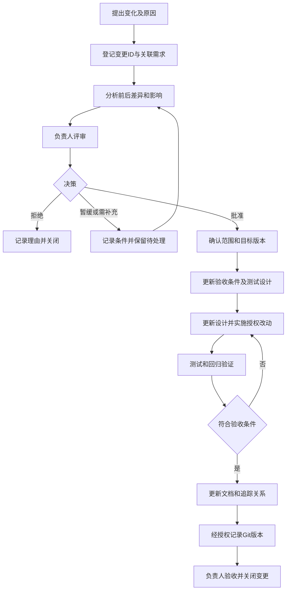

# 软件需求管理方法与规范研究报告

项目：个人博客系统（PC Web）<br>
文档性质：软件工程课程研究报告<br>
编写日期：2026-10-08<br>
文档版本：v0.1（研究初稿，待用户审阅；不是已确认的项目需求基线）

## 摘要

需求管理贯穿软件开发全过程，主要解决需求如何确认、如何控制变化、如何保存版本以及如何追踪到设计、实现和测试的问题。本报告在《软件需求获取、分析与表达方法及工具研究报告》的基础上，研究需求会议、需求确认、需求基线、变更控制、版本管理和双向追踪，比较常见管理工具，并提出适合个人博客课程项目的轻量级规范。报告提供可复用模板，但不将模板、代码现状或研究示例写成已经发生的会议、审批或验收。

当前博客系统先于全流程 Skill 开发完成。因此，对既有功能应开展回顾性整理和真实确认；对未来发生的变更，应先形成需求和测试设计，再实施与验证。研究成果将作为后续正式需求文档及 Skill 的规则输入。初稿研究阶段未建立正式需求基线、开发Skill或执行版本提交；本次按用户另行授权进行文档检查与提交，不改变研究初稿和非基线性质。用户暂定管理约定见[路线图1.1节](../project-planning/documentation-roadmap.md#11-用户暂定采用的管理约定)。

## 1. 需求管理概述

### 1.1 概念、目的与重要性

需求管理是对需求条目及其相关信息进行持续维护、确认、变更控制和追踪的活动。它不只是保存一份需求说明书，而是确保各阶段人员知道当前采用哪一版需求、哪些内容已经确认、哪些问题尚未解决，以及变化会影响哪些成果。NASA 的需求管理指导将基线变更控制与需求间的双向追踪作为主要活动；本报告借鉴其原则并进行课程项目裁剪，不照搬航天项目的组织规模和审批制度。[NASA：Requirements Management](https://www.nasa.gov/reference/6-2-requirements-management/)

有效的需求管理应达到四项目的：保持范围明确，避免未确认功能不断扩张；保持不同文档、页面和代码之间的一致性；通过可验证条件支持验收；保留真实决策和变更依据，使后续问题能够回溯。AI辅助开发虽然提高了整理和编码速度，但如果没有确认与版本边界，也可能更快地实现错误假设。因此，生成内容不等于确认需求，代码存在不等于验收完成。

### 1.2 与需求获取、分析和表达的关系

| 活动 | 核心问题 | 典型成果 | 与管理的联系 |
| --- | --- | --- | --- |
| 需求获取 | 需求来自哪里，使用者要解决什么问题？ | 来源材料、访谈或书面说明、现状清单 | 保存真实来源及证据，不以推断替代用户意见 |
| 需求分析 | 范围、角色、规则、优先级是否合理和一致？ | 分类需求、冲突与待确认问题、验收条件 | 跟踪分析结论、责任人和未解决事项 |
| 需求表达 | 怎样准确描述系统应完成的行为？ | 结构化条目、用例、流程和原型 | 对表达成果编号、评审并维护版本 |
| 需求管理 | 当前哪版有效，变化如何处理，是否得到落实？ | 确认记录、基线、变更台账、追踪矩阵 | 将来源、需求、设计、实现、测试和版本连接起来 |

四项活动不是严格的一次性顺序。评审可能发现遗漏并触发补充获取；测试发现的差异可能是缺陷，也可能需要重新确认业务规则。管理工作应贯穿这些反馈过程。

### 1.3 本报告依据及边界

本报告阅读了项目中的三份规划文档、前一份需求研究报告及根目录 README，并核对了 Vue 路由、用户资料接口、评论审核、用户状态管理、JWT过滤器及数据库脚本等代码。老师课堂要求的依据以[原始要求分析](../project-planning/teacher-requirements-analysis.md)为准，尤其是第一份转写约40:48—41:41的需求会议、结果管理和变化管理方向，以及测试计划和用例前置的要求。

| 内容 | 依据分类 | 本报告处理方式 |
| --- | --- | --- |
| 研究需求会议、需求结果和需求变化管理 | 老师明确要求的研究方向 | 形成方法、流程和模板；具体字段并非老师指定 |
| 需求明确后提前设计测试计划、用例和预期结果 | 老师明确强调的工作顺序 | 纳入阶段准入与变更规则 |
| Git/GitHub | 课堂介绍/建议；用户明确要求本项目使用 | 利用已有真实仓库；不扩大为未经核实的教师评分条款 |
| 需求ID、基线清单、版本号、追踪矩阵、审批模板 | 软件工程补充建议 | 作为拟采用方案，待用户确认 |

沿用前一研究报告的证据标签：**代码事实、用户/老师确认、分析推断、建议需求、待确认**。本报告所有空白模板及博客需求编号均为示例，不是正式 SRS、真实会议纪要或已批准需求记录。

## 2. 需求会议组织与管理

### 2.1 常见会议类型

| 类型 | 目标 | 参与角色（按实际情况安排） | 准备材料 | 组织流程 | 输出成果 |
| --- | --- | --- | --- | --- | --- |
| 需求启动会议 | 确定目标、范围、角色和工作方式 | 项目负责人、需求整理者、开发/测试人员；必要时老师 | 任务书、现有成果、范围草案、待确认问题 | 对齐目标→界定边界→确定分工和确认方式 | 范围意见、来源清单、行动项及责任人 |
| 需求访谈会议 | 了解特定角色的任务、问题和规则 | 实际用户或管理员、访谈者、记录者 | 提纲、场景、已有流程或原型 | 开放提问→具体场景追问→复述核对 | 真实访谈记录、候选需求、未解问题 |
| 需求评审会议 | 检查需求是否清楚、完整、一致和可验证 | 业务确认人、需求整理者、开发和测试角色 | 编号需求、用例、规则、验收条件、初步测试场景 | 按检查表审查→登记问题→分配修订→复核 | 评审意见和整改项；评审不自动等于批准 |
| 需求确认会议 | 明确采用的范围与版本 | 有权确认的项目负责人、需求整理者；必要时其他相关人 | 修订稿、已解决问题、剩余风险、版本差异 | 核对版本→逐项决策→确定基线范围 | 确认记录、暂缓项、基线建立决定 |
| 需求变更评审会议 | 判断是否接受变化及其影响 | 提出者、批准者、开发/测试角色 | 变更申请、前后对比、影响与成本、验证方案 | 澄清原因→比较方案→批准/拒绝/暂缓 | 决策、条件、目标版本及实施责任 |

小型个人项目可以一人承担多个实际角色，但必须明确是谁确认、谁整理，不能虚构多人参会。简单事项可以通过真实的书面问答或异步评审确认，记录其实际形式，不将聊天确认包装成现场会议。Codex可以辅助整理，但不能作为业务批准者。

### 2.2 组织规范

会前确定会议目标、待决问题、材料版本和有权确认的人；邀请参与者预读，避免将会议变成现场阅读。会中按业务问题讨论，将事实、建议、结论和待确认项分开记录；争议不能靠记录者自行选择。会后发送纪要并请参与者核对，逐项关闭行动项。没有明确答复不能视为同意，未参会人员不能被填入参与名单。

敏感配置、真实密码、令牌和个人信息不应进入公开纪要。需要引用用户材料时，仅保留必要的脱敏信息和可核验来源。

### 2.3 会议议程模板（空白模板）

```text
会议ID：<实际组织后编号>
会议类型/主题：
目标及必须决策的问题：
实际日期、时间、方式：
主持人/记录人/业务确认人：
拟参与角色：<发出议程时填写；实际出席另记>
会前材料及版本：
议程：
  1. 目标、范围和上次行动项核对
  2. 逐项审查需求/变更及验收条件
  3. 讨论冲突、影响与备选方案
  4. 确认决策、待确认项、责任人与期限
预期输出：
```

### 2.4 会议纪要模板（仅实际发生后填写）

| 字段 | 应填写内容 |
| --- | --- |
| 会议ID、主题、类型、实际时间与方式 | 与真实组织情况一致；未召开则不填写纪要 |
| 实际参与者及承担角色 | 区别于邀请名单；个人项目如实记录 |
| 输入材料和版本 | 文档路径、版本及本次审查范围 |
| 讨论项 | 问题ID、关联需求ID、意见来源、备选方案 |
| 结论 | 同意/不同意/暂缓/待确认；理由与适用范围 |
| 行动项 | 行动ID、任务、负责人、期限、完成证据 |
| 未解决事项 | 问题、影响、责任人及下一步确认方式 |
| 纪要核对 | 实际核对人、日期、反馈来源和修订说明 |

行动项可采用“编号—任务—负责人—截止日期—状态—证据”的表格，不能用“已完成”替代完成证据。访谈纪要还应区分受访者原意与整理者推断。

## 3. 需求确认与需求基线

### 3.1 确认方法与评审标准

需求确认应结合结构化文档评审、业务场景走查、原型核对和验收条件检查。文本评审适合规则和权限，原型适合布局与交互，场景走查用于验证正常及异常路径。现有系统可以做回顾性演示和代码核对，但运行现状不能代替负责人对目标行为的确认。

沿用前一报告的正确性、完整性、一致性、无歧义性、可验证性、可追踪性和可修改性要求，建议使用以下检查表：

| 检查方面 | 确认标准 |
| --- | --- |
| 来源与范围 | 需求有来源，角色与边界明确；不把常见博客功能自行加到范围内 |
| 行为与业务规则 | 输入、条件、输出、状态变化及重要异常能够解释 |
| 一致性 | 术语、角色权限、状态、前后端约束不矛盾 |
| 验收条件 | 有可观察结果及正常、异常、权限/边界场景，不只写“正常可用” |
| 可行性与风险 | 技术依赖、数据迁移、外部邮件配置及待确认问题已识别 |
| 追踪与责任 | ID稳定、来源可定位、确认者明确，后续设计与测试有入口 |

**验收条件示例（拟采用）：**管理员通过评论审核后，公开评论查询应包含该评论；同一状态的重复审核不得再次增加文章评论计数。此例依据当前审核代码提出，可转为测试条件，但没有在本轮执行测试，也尚未作为正式需求批准。

### 3.2 确认记录模板

```text
确认记录ID：
确认对象：<需求ID集合、文档路径及版本>
范围和不包含的内容：
采用的确认方式：<实际评审/书面答复/场景演示>
逐项结果：<已确认/需要修改/暂缓/拒绝>
验收条件与测试设计引用：
未解决问题及其影响：
批准条件/适用限制：
实际确认人、日期及证据位置：
是否允许进入下一阶段：<明确结论；未确认留空>
```

确认记录须绑定具体版本。“认可总体方向”不能自动解释为认可全部字段、权限或异常规则。

### 3.3 基线建立与阶段准入

需求基线是经有权人员确认并纳入变更控制的一组需求及其版本，不是某个文件名或任意Git提交。建议建立基线前完成：范围与来源核对、核心需求评审、重要问题处理、验收条件定义、测试计划和用例初稿，并保留真实批准证据。阻塞性问题未解决时不批准整体基线；如果只确认独立模块，应明确局部基线边界和依赖。

建议基线清单包含：基线ID及版本、需求ID集合、文件路径与版本、确认记录引用、排除/暂缓项、验收条件、测试设计引用、建立人和日期、真实Git提交及其链接。所有未实际确定的字段标“待确认/待提交”，不得预填批准日期或提交ID。

需求确认后可以进入相应设计阶段；在详细设计和编码实施前应准备测试计划、测试用例与预期结果。早期技术调研或草图可以在确认前进行，但属于探索，不代表获准实现整个范围。对本系统的既有代码，只能从现在建立回顾性确认基线，不声称过去已经满足该顺序。

### 3.4 冻结与重新开放

需求冻结是将已确认版本置于控制之下，并不意味着永远不允许修改。纯排版或错字修订可按编辑性修改记录处理；改变行为、范围、权限、数据或验收条件的修改必须走变更评审。已确认需求重新开放时保留旧版及确认记录，登记原因、影响和目标版本；新版本确认前，旧基线仍是有效依据。紧急修复可以简化评审形式，但仍需真实授权、影响记录及回归验证。

## 4. 需求变更管理

### 4.1 变更流程

需求变化应区分新功能、规则调整、范围缩减、缺陷修复和文档纠错。若实现不符合已确认需求，通常作为缺陷处理；若期望行为发生变化，则作为需求变更处理。不确定时先确认，不能仅以“优化”为理由扩大功能。



该图为推荐流程，不是已执行记录。批准需求变更不等于授权任意删除数据、公开敏感资料或推送远程仓库；相关操作仍应遵守用户授权边界。

### 4.2 各阶段记录要求

| 阶段 | 主要内容 | 退出条件 |
| --- | --- | --- |
| 提出与登记 | 来源、目标、理由、关联需求、现状与期望、紧迫性 | 原因与对象明确，可识别重复申请 |
| 影响分析 | 页面、接口、服务、数据库、安全、测试、文档及兼容性 | 影响点和未知项列出；给出工作量区间与依据，不伪造精确估算 |
| 评审与审批 | 备选方案、风险、批准/拒绝/暂缓、条件与目标版本 | 实际批准者和证据明确；暂缓不进入实施 |
| 实施 | 按批准范围调整验收/测试、设计及实现，保留差异 | 无无关改动；变更与需求可追踪 |
| 验证 | 正常、异常、权限、边界和回归场景 | 真实结果和证据；失败与未执行明示 |
| 文档、版本与关闭 | 同步需求、设计、接口、运行说明及追踪，记录实际提交 | 用户验收，剩余问题有处理结论，受影响成果一致 |

### 4.3 变更申请、审批和实施模板

以下为一个变更条目的空白组合模板，小项目可在同一文档中维护，避免为了流程增加大量文件。

```text
变更ID：<例如 BLOG-CR-2026-001；正式编号以后登记>
标题、提出人/来源、实际提出日期：
关联需求ID及当前基线版本：
变更类型：<新增/规则调整/缩减/疑似缺陷/编辑修订>
变更前行为及证据：
变更后期望与原因：
验收条件及不包含内容：
影响分析：<页面/接口/服务/数据/权限/测试/文档/配置>
风险、兼容性、迁移/回退考虑、工作量依据：
备选方案及推荐理由：
审批：<实际决定、确认人、日期、证据、条件、目标版本>
实施：<实际负责人、改动文件、执行日期、提交ID/待提交>
验证：<用例ID、环境、结果、证据、未测事项>
文档与追踪更新：
关闭：<验收人、日期、结论、遗留问题去向>
```

### 4.4 博客项目的影响分析范围

| 影响层面 | 应检查的实际位置与问题 |
| --- | --- |
| 前端 | `blog-web/src/views/`、布局、路由、API和Pinia：页面输入、反馈、状态同步、权限入口是否改变？ |
| 后端 | Controller、DTO/VO、Service和Security：请求契约、校验、事务、身份与角色判断是否受影响？ |
| 数据库 | `schema.sql`、迁移脚本、Entity/Mapper：字段、约束、关联、历史数据、计数是否改变？是否确需迁移？ |
| 接口 | 请求方式/路径/参数/返回结构是否变化？公开与受保护接口边界是否保持？前后端是否一起更新？ |
| 测试 | 需要哪些新增用例和回归用例？旧测试是否仍体现确认规则？是否涉及MySQL/文件/SMTP环境？ |
| 文档与交付 | 需求、原型、设计、接口、使用说明和环境示例是否需同步？是否包含不应公开的凭证？ |

**回顾性示例：头像由URL输入改为本地上传。**当前代码已实现此能力，本报告只用其说明分析方法，不重建历史审批。该变化涉及个人中心选图和预览、FormData/API、用户头像接口、存储服务和静态访问、`sys_user.avatar`、上传校验和旧文件清理测试。数据库继续保存相对路径，因此不能仅因功能变化就断言需要新表。当前5MB及JPG/PNG/WebP限制应从代码核对，并由负责人确认是否纳入需求。后续如改变大小上限，应重新检查前端、multipart配置、后端服务及测试，不只改页面提示。

### 4.5 关闭条件

批准后的变更只有在验收条件满足、相关回归完成、文档与追踪更新、实际版本可定位且负责人确认后才关闭。未测试或测试失败不得写“验证通过”；允许带遗留问题交付时，应由负责人明确接受风险并指定后续处理。拒绝申请可以记录理由关闭，但不能标成“已实现”；暂缓申请仍保留在待处理集合中。

## 5. 需求版本管理

### 5.1 需求编号规则（拟采用）

沿用前一报告的`BLOG-F-001`格式，不重新建立冲突编号体系。

| 对象 | 建议格式 | 含义 |
| --- | --- | --- |
| 功能需求 | `BLOG-F-001` | F表示功能；按登记顺序分配，不编码页面位置 |
| 非功能需求 | `BLOG-NF-001` | 如安全、可靠性和可维护性要求 |
| 业务规则 | `BLOG-BR-001` | 如评论公开条件及账号禁用规则 |
| 变更申请 | `BLOG-CR-2026-001` | 按实际年份和顺序登记 |
| 测试用例 | `BLOG-TC-001` | 独立编号，可关联多项需求 |
| 确认/会议/基线记录 | `BLOG-DEC-001` / `BLOG-MTG-001` / `BLOG-BL-001` | 只在真实产生时登记 |

同一需求编辑后ID不变；实质拆分为多个独立目标时分配新ID并保留替代关系。撤销编号不复用。文件版本与条目ID分开，GitHub Issue号不能代替稳定需求ID。

### 5.2 状态管理

需求主生命周期建议采用“草稿→待确认→已确认→已实现→已验证”，另设“已撤销”，与前一报告保持一致。每次转换应有证据：待确认到已确认需要真实决定；已实现需要具体代码证据；已验证需要实际测试及确认的验收结果。变更后受影响项可回到待确认，并保留之前状态与原因。

对本系统，应另外记录**现状实现状态**和**验证状态**。已有代码的需求可以是“确认状态：待确认；现状：代码已存在；验证：未执行”，不能为符合单一状态链而假装先前已确认。需求状态、Issue任务状态和文章/评论业务状态是不同概念，不混用`PENDING/APPROVED`作为需求生命周期。

### 5.3 文档版本和历史记录

建议采用`v主版本.次版本.修订版本`的本项目约定：草稿从`v0.1`开始；首次正式确认基线为`v1.0.0`；已批准的兼容性需求补充可为`v1.1.0`；仅文字、链接或排版纠错可为`v1.0.1`；重大范围或关键契约变化可为`v2.0.0`。这只是项目约定，不表示严格采用软件包语义化版本标准，也不意味着当前报告已经建立v1.0基线。

版本历史模板：

| 文档版本 | 实际日期 | 变更内容/需求ID | 变更或确认记录 | 修改者/确认者 | Git提交 |
| --- | --- | --- | --- | --- | --- |
| `<待填写>` | `<实际发生后填写>` | `<前后差异>` | `<真实来源>` | `<真实人员>` | `<实际提交后填写或待提交>` |

不得仅修改版本号而删除旧决策和差异。若无法定位历史来源，应明确记为“来源待补充”，不能补造日期。

### 5.4 Git管理及基线关联

Git可记录文件快照和差异，标签可以定位重要提交，但不能证明需求已经得到用户批准。[Pro Git：记录更新](https://git-scm.com/book/en/v2/Git-Basics-Recording-Changes-to-the-Repository)；[Pro Git：标签](https://git-scm.com/book/en/v2/Git-Basics-Tagging.html)

初稿研究时的只读检查确认仓库位于`main`并跟踪`origin/main`，远程为`https://github.com/apte038-spec/personal-blog-system.git`，当时HEAD为`c5100cd`，主题为`chore: initial import of personal blog system`。它是已有系统的初次纳管提交，不是需求基线。当时规划及研究文件未跟踪且未提交；后续按用户授权正常纳管，具体结果以真实Git历史为准。该快照不表示永久当前状态，也不证明Issues/Projects已配置。

拟采用以下流程：

1. 需求主内容使用Markdown，在已规划的需求文档路径维护；记录来源、版本、确认和变更ID。
2. 每个真实阶段完成后核对差异、文档与代码一致性及敏感信息；由用户授权后再提交。
3. 实际需求基线确认后记录文件清单、需求集合和批准证据，并用真实提交定位快照。可在后续管理记录中补充该提交ID，避免要求提交前把尚不存在的自身Commit ID写进文件。
4. 如需标签，可在用户确认后给对应快照加`requirements-v1.0.0`等标签；软件版本标签与需求基线标签分开。
5. 变更提交说明引用需求或变更ID。示例主题：`docs: define requirements management policy`或`fix: address BLOG-CR-2026-001`，只用于未来真实工作。
6. 简单文档阶段可以在main维护；涉及业务变更时可使用短期分支和Pull Request复核。分支/PR为拟采用方式，本轮不创建。

Git提交不是会议、需求批准或测试证据的替代品。没有历史记录的早期开发过程保持未知；不修改提交时间，不制造过去的审批或Skill指导开发历史。

## 6. 需求追踪管理

### 6.1 双向追踪及矩阵结构

正向追踪检查需求是否进入设计、实现与测试；反向追踪检查设计元素、代码或测试是否具有合理需求来源。追踪应维护具体关联而非只列出模块名称。NASA的软件工程指导强调需求与设计间的双向关联，矩阵应随变化维护；本项目进一步将关联延伸到实现和测试，作为轻量质量检查。[NASA：Bidirectional Traceability](https://swehb.nasa.gov/pages/viewpage.action?pageId=16451898)

建议最低字段如下：

| 字段 | 维护要求 |
| --- | --- |
| 需求ID、名称 | 稳定编号和可区分名称 |
| 需求来源 | 用户说明、老师材料或代码事实及其位置；推断需标识 |
| 优先级 | 采用MoSCoW：Must/Should/Could/Won't（本期不做），由负责人确认 |
| 设计模块 | 用例、原型、架构/接口/数据设计的具体位置；缺失标待补 |
| 实现模块 | 页面/组件、接口、Service、Mapper和表等实际位置 |
| 测试用例ID | 用例及覆盖的验收条件；只有计划时注明拟定 |
| 当前状态 | 确认、实现、验证分开；不从代码存在推断批准或测试通过 |
| 对应版本 | 需求版本、基线和实际实现提交；不同版本含义分开 |

可按需补充责任人、业务规则ID、变更ID、缺陷ID、测试证据和更新时间。一个需求可以关联多个设计和测试，不应强制一对一关系。

### 6.2 覆盖检查方法

每次阶段检查应回答：是否所有本期已确认需求都有设计及验收条件；是否所有需实施需求都能定位代码；是否每条验收条件有至少一个测试场景；是否每个“通过”都有真实执行证据；新增实现是否超出确认范围；需求变化是否同步更新设计、代码、测试及文档。

覆盖率可以分别统计“有设计关联的已确认需求数/本期已确认需求总数”“有测试用例的已确认需求数/本期已确认需求总数”。有关联并不等于设计或测试正确；还应审查关联内容。当前尚未建立正式需求全集，不能计算或宣称覆盖率达到100%。

### 6.3 博客追踪矩阵示例（非正式基线）

下表根据代码现状提出示例编号，优先级全部为拟定Must，设计和测试引用尚待真实建立；本轮不执行功能测试。

| 需求ID/名称 | 来源 | 优先级 | 设计模块 | 实现模块/数据 | 测试用例ID | 当前状态 | 对应版本 |
| --- | --- | --- | --- | --- | --- | --- | --- |
| `BLOG-F-001` 用户注册登录 | README、AuthController、UserServiceImpl（代码事实） | Must（拟） | 认证用例/权限设计待归档 | Login.vue、auth.js、AuthController、UserServiceImpl；sys_user | BLOG-TC-001/002（拟：成功及错误密码） | 待确认；代码存在；本轮未测 | 需求草稿；代码HEAD c5100cd；非基线 |
| `BLOG-F-002` 后台文章管理 | ArticleManage.vue、ArticleServiceImpl（代码事实） | Must（拟） | 文章生命周期及接口设计待归档 | 后台文章页面/接口/服务；blog_article、blog_category、blog_article_tag、blog_tag | BLOG-TC-003/004（拟：草稿/发布及权限） | 同上 | 同上 |
| `BLOG-F-003` 评论审核 | CommentManage.vue、CommentAdminServiceImpl（代码事实） | Must（拟） | 审核状态及计数规则待归档 | 评论管理和文章详情；blog_comment、blog_article、sys_user | BLOG-TC-005/006（拟：批量通过及重复审核） | 同上 | 同上 |
| `BLOG-F-004` 个人资料维护 | Profile.vue、UserProfileController（代码事实） | Must（拟） | 个人中心用例待归档 | profile.js、UserServiceImpl；sys_user | BLOG-TC-007（拟：本人修改与用户名占用） | 同上 | 同上 |
| `BLOG-F-005` 账号启用与禁用 | AdminUserServiceImpl、JwtFilter（代码事实） | Must（拟） | 权限矩阵及禁用规则待归档 | UserManage.vue、用户服务与鉴权；sys_user | BLOG-TC-008/009（拟：禁用登录/旧Token及历史评论） | 同上 | 同上 |
| `BLOG-F-006` 本地头像上传 | UserProfileController、AvatarStorageServiceImpl（代码事实） | Must（拟） | 文件校验与上传流程待归档 | Profile.vue、profile.js、用户/存储服务；sys_user.avatar及本地目录 | BLOG-TC-010/011（拟：合法图片及超限/伪造） | 同上 | 同上 |
| `BLOG-F-007` 邮箱重置密码 | ForgotPassword.vue、PasswordResetServiceImpl（代码事实） | Must（拟） | 验证码与账号规则待归档 | auth.js、AuthController、密码重置服务；sys_user、email_verification_code | BLOG-TC-012/013（拟：有效及过期/使用/禁用） | 同上 | 同上 |

这只是代表性条目，不是全部需求清单。后续应按需要将注册、登录、密码修改等不同目标拆成可独立验收条目，并保持ID映射；不得将示例测试ID写成已经存在的自动化用例或已通过的测试结果。

## 7. 需求管理工具研究

### 7.1 功能、适用性及使用成本比较

工具成本不仅包括许可费用，还包括部署、学习、字段维护、备份和跨工具同步。本报告不列易变化的具体价格，不保证不同版本具有相同功能。

| 工具 | 主要能力 | 优点与适用场景 | 局限及课程项目成本 | 本项目状态 |
| --- | --- | --- | --- | --- |
| Git + Markdown | 文件快照、差异、历史、分支和标签；文本规范自由组织 | 已有仓库可直接使用；需求、设计及代码能一起维护 | 不是自动审批/追踪系统；需维护编号、记录和链接。无需额外管理平台，维护成本较低 | Git已使用，研究/规划以Markdown维护；正式需求管理规则待确认 |
| GitHub Issues | 记录需求、任务和缺陷，评论沟通，标签/里程碑和代码关联 | 与已有仓库衔接，适合少量实际变更和行动项 | 自定义正式审批及追踪需约定；公开Issue也不能存放敏感资料。基础使用成本低 | 推荐后续使用；本轮未创建或核实既有Issue台账 |
| GitHub Projects | 表格/看板/路线图、自定义字段、筛选与Issues/PR关联 | 适合任务增多后观察阶段和进度 | 建立字段和保持状态同步需要维护；不替代需求正文和确认记录 | 可选计划，未确认已启用 |
| Jira | 工作项、状态/转换工作流、计划和跟踪 | 适合多人协作和较复杂流程，可统一处理需求任务与缺陷 | 学习和流程配置较多；方案/额度影响费用；对单人作业引入额外平台不一定划算 | 仅研究比较，未接入 |
| 禅道 | 官方产品经理教程涵盖需求创建、评审、变更等流程 | 适合希望使用中文界面和较完整需求管理过程的团队 | 不同版本功能有差异；自行部署还需安装、维护和备份，许可费用须按所选版本核实 | 仅研究比较，未部署 |

功能依据：[GitHub Issues官方说明](https://docs.github.com/en/issues/tracking-your-work-with-issues/learning-about-issues/about-issues)、[GitHub Projects官方说明](https://docs.github.com/en/issues/planning-and-tracking-with-projects)、[Jira产品说明](https://www.atlassian.com/software/jira)、[Jira工作流说明](https://support.atlassian.com/jira-software-cloud/docs/what-are-jira-workflows/)、[禅道产品经理教程](https://www.zentao.net/book/zentaopms/249.html?fullScreen=zentao)。禅道页面的官方搜索摘要确认需求评审与变更方向，本次正文抓取未成功，因此不据此断言具体版本的审批字段、免费功能或完整操作界面。表中的优缺点和个人项目成本是本报告的适用性分析，不是厂商承诺。

### 7.2 本项目选型

建议采用“**Markdown权威需求记录 + Git版本控制 + GitHub Issues实际任务/变更沟通**”。已有仓库无需迁移到其他平台；少量需求可以先维护文档，出现真实变更后再登记Issue。任务较多时可加Projects，不为展示工具数量同时使用Jira和禅道。

需求正文、验收条件和确认版本以文档为准；Issue引用需求ID、变更ID及文档位置，记录实际讨论、行动项和证据。若Issue决定改变需求正文，应同步更新文档，不维护互相冲突的双重权威。Issue关闭或看板移动至Done不自动表示需求已验证或用户已验收。

## 8. 个人博客系统需求管理方案

### 8.1 现状及方案定位

当前系统具有游客、普通用户USER和管理员ADMIN三类使用者，技术为Vue 3、Spring Boot和MySQL。公开文章、用户认证、互动、个人中心及后台管理均有代码，数据库包含用户、验证码、分类、标签、文章、文章标签关联、评论、留言、点赞和站点配置等10张表。业务页面从当前路由确定，不将未接入路由的旧Vue文件视为需求成果。

现有系统已开发完成，但正式需求来源、基线、会议和变更记录仍需整理。以下为**拟采用规范**，不是对历史开发过程的描述。当前代码行为与真正业务目标如有差异，应保留差距，经用户决定后处理，不能为使文档看似完整而将所有实现自动认可为需求。

### 8.2 轻量级管理规范

1. **统一条目。**每条需求保存ID、来源标签、角色、描述、优先级、验收条件和状态；沿用前一研究报告的结构化模板。
2. **统一责任。**用户/项目负责人确认业务范围、优先级、基线和变更，Codex辅助整理、检查和实施授权任务；老师确认课程要求的不确定部分。
3. **统一优先级。**沿用MoSCoW，不与路线图的文档P0—P3混为一谈；功能优先级与文档编写顺序可以不同。代表性功能的Must仅为建议，需用户确认。
4. **小范围确认。**按认证、文章、互动审核、个人中心、后台基础管理逐模块确认；记录真实日期、所审版本及未解决问题。
5. **先验收条件和测试设计。**未来变更实施前列出正常、异常、权限及回归场景，再更新设计；既有功能的补测如实标为回顾验证。
6. **受控变化。**行为或范围变化有CR编号、影响分析和真实批准；编辑性改动记录差异，不滥用完整审批流程。
7. **版本可定位。**文档版本、基线版本、代码提交分开管理；阶段完成、审查和用户授权后才形成真实提交。
8. **双向追踪。**在既有路线图第16和第22项中维护设计追踪与测试追踪，并引用同一需求ID，不复制多份不一致台账。
9. **证据诚实。**未确认、未执行、待提交分别标记；不伪造会议信息、签名、测试通过或旧开发历史。

### 8.3 典型模块的确认重点（示例）

| 模块 | 当前代码可支持的事实 | 后续应确认与测试的重点 |
| --- | --- | --- |
| 注册登录 | 注册普通用户；登录及JWT鉴权；账号状态检查 | 输入约束前后是否一致、重复注册、密码错误、角色权限和Token失效 |
| 文章管理 | 后台维护文章；前台查询发布内容 | 草稿/发布边界、分类/标签关系、逻辑删除及分页筛选 |
| 评论管理 | 评论审核状态和批量审核；状态变化维护计数 | 未审核不公开、重复审核幂等、拒绝已通过评论及权限 |
| 个人中心 | 修改用户名/密码、查看喜欢文章和退出 | 只修改本人、用户名占用、密码变更后的登录状态及分页 |
| 用户启停 | 管理员修改状态；JWT请求查询有效用户 | 禁用登录和旧Token、历史审核内容保留、自我禁用限制 |
| 头像上传 | 本人上传接口、校验及UUID文件；avatar保存路径 | 预览取消、5MB边界、格式/签名、同步状态、安全清理和访问 |
| 忘记密码 | 邮箱验证码、使用/有效期/发送间隔和禁用检查 | 正确与错误验证码、过期/已使用、SMTP失败及新旧登录状态 |

这里的“应确认与测试”不是测试通过声明。例如邮箱密码重置后的旧Token处理，应读取当前实现并与用户期望核对，不能因为登录用户修改密码有Token版本处理，就推断忘记密码完全采用相同流程。

### 8.4 逐步落地顺序（拟采用）

先由用户审阅两份研究报告并选择规范；随后整理真实需求来源、回顾性确认现有模块；再形成SRS/用例和基线，提前设计测试计划与用例，补充原型和设计追踪；最后对真实发生的变更使用CR流程，记录测试证据与授权提交。会议和确认材料只在真实发生后归档。本轮只完成研究报告，不替代上述正式成果。

## 9. AI辅助需求管理

### 9.1 可辅助的工作

在具有项目读取权限和明确任务范围时，Codex可以协助提取条目、维护术语和来源标签，检查需求冲突与含糊表述，草拟会议议程及确认问题，定位前后端/数据库变更影响，维护追踪矩阵，提出测试场景，核对需求、接口、代码和文档差异。输出应引用可核验文件或真实来源，而不是只依据通用博客经验。

对于变更影响分析，应分别列“已证实影响”“可能影响”“需用户决定”；对于测试，分别列计划、实际执行与证据。静态检查不等同于运行验证，模型生成的确认模板不等同于用户批准。

### 9.2 人工确认边界

业务目标、范围取舍、优先级、矛盾裁决、需求基线、变更批准及带风险验收必须由有权用户决定；教师要求不明时须向老师确认。AI不能代签、不能把沉默当同意，也不能以“测试通常会通过”为理由填结果。提交和推送、数据删除、数据库迁移等操作应在用户授权范围内进行，批准文档内容不自动授权全部外部操作。

### 9.3 后续Skill的可复用规则输入

以下是后续Skill设计应采用的规则建议，本轮不创建任何Skill文件：

| 检查节点 | 规则 | 未满足时的处理 |
| --- | --- | --- |
| 读取与识别 | 先读取真实材料和代码；保留来源标签 | 缺少来源记待确认，不自行补造 |
| 需求整理 | 条目有稳定ID、角色、边界和验收条件 | 提出明确问题，避免直接进入实现 |
| 人工确认 | 记录确认人、版本、范围和证据 | 未确认不标基线；必要时仅做已授权探索 |
| 设计准入 | 需求映射设计，测试计划/用例提前准备 | 标出覆盖缺口，等待相关决策 |
| 变更控制 | CR登记、影响分析、真实批准先于实施 | 不执行超出范围的改动 |
| 测试验证 | 结果来自实际运行，正常/异常/权限覆盖 | 失败和未执行明示，不虚构通过 |
| 文档与追踪 | 同步需求、设计、实现、测试和版本 | 不一致项进入问题清单 |
| Git与交付 | 审查差异、敏感信息和授权，记录真实提交 | 未授权不暂存/提交/推送，不伪造历史 |
| 阶段退出 | 提交成果、证据、遗留问题并等待用户确认 | 不擅自进入下一阶段 |

这些规则是工作流输入，不是已经被Codex自动加载或执行的Skill能力。Skill是否可调用、是否有效仍需在后续创建及真实任务验证时证明。

## 10. 研究结论

需求管理应形成“来源清晰—表达明确—真实确认—基线受控—变化可追踪—结果可验证”的闭环。需求会议用于沟通和决策，确认记录用于说明采用的版本和范围，变更控制用于避免未经评估的扩张，Git用于定位真实文件版本，追踪矩阵用于连接需求、设计、实现和测试。各项工具不能相互替代，尤其不能以提交、Issue关闭或代码存在代替需求批准和测试验收。

对个人博客课程项目，推荐Markdown、Git和按需引入的GitHub Issues组合，不设复杂审批委员会，不为数量目标制造多份重复文档。先回顾整理已实现系统并进行真实确认，再对后续变化采用前置测试设计、影响分析、授权实施和证据闭环，以此为后续全流程Skill提供可复用规范。

本报告初稿已完成，但项目正式需求基线、实际会议/确认记录、变更台账和测试追踪尚未建立。用户在第十一步暂定采用Markdown/Git、BLOG-F/NF/BR、BLOG-CR、BLOG-TC及v0.1/v1.0.0管理约定，Issues按需使用；这不代表具体需求或基线获准。功能优先级、具体验收条件与确认结果仍需逐项审阅，课程文档数量及签字要求仍以老师后续确认结果为准。

## 参考资料与项目证据

外部资料访问/检索日期：2026-10-08。正文为结合课程规模的研究与裁剪，不声称通过任何行业认证。

1. NASA. *6.2 Requirements Management*. [官方指导](https://www.nasa.gov/reference/6-2-requirements-management/)。
2. NASA Software Engineering Handbook. *SWE-059—Bidirectional Traceability*. [官方指导](https://swehb.nasa.gov/pages/viewpage.action?pageId=16451898)。
3. Chacon, S.; Straub, B. *Pro Git*, Recording Changes to the Repository; Tagging. [记录更新](https://git-scm.com/book/en/v2/Git-Basics-Recording-Changes-to-the-Repository)；[标签](https://git-scm.com/book/en/v2/Git-Basics-Tagging.html)。
4. GitHub Docs. *About issues*. [官方文档](https://docs.github.com/en/issues/tracking-your-work-with-issues/learning-about-issues/about-issues)。
5. GitHub Docs. *Planning and tracking with Projects*. [官方文档](https://docs.github.com/en/issues/planning-and-tracking-with-projects)。
6. Atlassian. *Jira*; *What are Jira workflows?*. [产品说明](https://www.atlassian.com/software/jira)；[工作流说明](https://support.atlassian.com/jira-software-cloud/docs/what-are-jira-workflows/)。
7. 禅道. *视频教程：禅道使用之产品经理篇*. [官方使用手册](https://www.zentao.net/book/zentaopms/249.html?fullScreen=zentao)；本轮依据官方检索摘要核实主题，页面正文抓取未成功，不据此认定具体版本细节。

项目依据：

- [老师原始要求分析](../project-planning/teacher-requirements-analysis.md)、[项目差距分析](../project-planning/assignment-gap-analysis.md)、[技术文档路线图](../project-planning/documentation-roadmap.md)。
- [需求获取、分析与表达研究报告](requirements-methods-and-tools.md)、[项目README](../../README.md)。
- `blog-web/src/router/index.js`、`src/api/`及当前登录、文章、个人中心和后台管理页面。
- `blog-server/src/main/java/com/example/blog/controller/`、`service/impl/`、`security/JwtFilter.java`、实体及Mapper；特别核对UserProfileController、UserServiceImpl、AdminUserServiceImpl、CommentAdminServiceImpl、AvatarStorageServiceImpl和PasswordResetServiceImpl。
- `blog-server/src/main/resources/schema.sql`及现有迁移脚本。数据库脚本以原位置为准，本轮不移动、不修改。

初稿研究阶段只进行了文档与代码静态核对及工具资料研究，没有运行网站、测试、SMTP收件验证或Git写操作；后续文档审查与提交不等于功能测试或需求审批。不得将研究与版本管理结果引用为功能验收证据。
